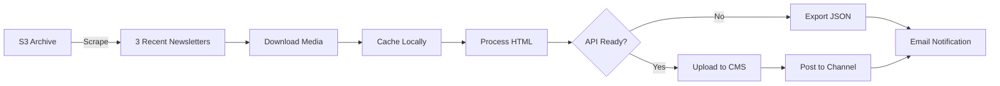

ב״ה
# MVP Scope & Implementation Plan

## Scope Summary

**What we're building**: A lightweight tool to process 3 recent newsletters + weekly updates (NOT 400 newsletters)
**Timeline**: 1 week with mock API, ready to swap when real API available
**Current blocker**: ChabadUniverse API not yet available (building with mock)

## Process Flow



## Development Milestones

### Milestone 1: Foundation (Days 1-2)
**Goal**: Project setup with working mock API

- [ ] Initialize Next.js 15 with App Router
- [ ] Set up MongoDB connection
- [ ] Create mock API server
- [ ] Configure Valu iframe integration
- [ ] Basic project structure

### Milestone 2: Scraping (Day 3)
**Goal**: Successfully scrape and store newsletters

- [ ] Archive parser (fetch from S3)
- [ ] Newsletter scraper (extract HTML/media)
- [ ] MongoDB schemas (Newsletter, ProcessingSession)
- [ ] Duplicate prevention logic
- [ ] Test with real archive

### Milestone 3: Processing (Day 4)
**Goal**: Process newsletters and media

- [ ] Media downloader with caching
- [ ] URL rewriter for HTML
- [ ] Email notification service
- [ ] Processing status tracking
- [ ] Error recovery mechanism

### Milestone 4: Admin UI (Day 5)
**Goal**: Complete admin interface

- [ ] Dashboard with newsletter list
- [ ] Scraping controls
- [ ] Processing status indicators
- [ ] Preview functionality
- [ ] Export to JSON

### Milestone 5: Production (Day 6)
**Goal**: Deploy and verify

- [ ] Deploy to Vercel
- [ ] Configure MongoDB Atlas
- [ ] Test in ChabadUniverse iframe
- [ ] Verify email notifications
- [ ] Documentation complete

## Core Components

### 1. Newsletter Scraper
```typescript
class NewsletterScraper {
  async fetchRecentNewsletters(count = 3)
  async scrapeNewsletter(url: string)
  async checkForWeeklyUpdate()
}
```

### 2. Media Processor
```typescript
class MediaProcessor {
  async downloadMedia(url: string): string // Returns cached path
  async processNewsletterMedia(urls: string[])
  rewriteHtml(html: string, mapping: MediaMap): string
}
```

### 3. Mock API Server
```javascript
// Mimics future ChabadUniverse API
POST /api/v1/cms/media     // Upload media
POST /api/v1/channels/posts // Post newsletter
GET  /api/v1/auth/user      // Verify admin
```

## Database Schema

```typescript
Newsletter {
  slug: string (unique)      // "5785-nitzavim"
  status: enum               // scraped|processing|ready|published
  sourceUrl: string
  originalHtml: string
  processedHtml: string
  mediaMapping: [{
    original: string
    cached: string
    cms: string | null
  }]
  timestamps: true
}
```

## Weekly Workflow

### Initial Setup (One-time)
1. Admin opens tool in iframe
2. Click "Initialize Recent Newsletters"
3. System fetches last 3 newsletters
4. Process and cache media
5. Mark as "ready_to_publish"

### Weekly Updates
1. Cron job or manual trigger
2. Check for new newsletter
3. Skip if already exists
4. Download and process
5. Send email to retzion@merkos302.com
6. Export JSON or auto-publish (when API ready)

## Success Criteria

### Must Have (MVP)
- ✅ Scrape 3 recent newsletters
- ✅ Download all media
- ✅ Prevent duplicates
- ✅ Email notifications
- ✅ JSON export

### Should Have
- Weekly automation
- Preview before publish
- Error recovery
- Processing metrics

## Testing Checklist

```markdown
## Functionality
- [ ] Fetches exactly 3 recent newsletters
- [ ] No duplicate entries created
- [ ] All media downloaded successfully
- [ ] HTML preserved exactly
- [ ] Email sent to correct recipient

## Error Handling
- [ ] Archive unavailable handled
- [ ] Media download failures logged
- [ ] Network timeouts recovered
- [ ] Invalid HTML parsed safely

## Integration
- [ ] Valu iframe authentication works
- [ ] Mock API responds correctly
- [ ] MongoDB operations successful
- [ ] Vercel deployment functional
```

## Environment Setup

```env
# Required for MVP
ARCHIVE_BASE_URL=https://merkos-living.s3.us-west-2.amazonaws.com
MONGODB_URI=mongodb://localhost:27017/living-with-rebbe
SMTP_USER=your-email@domain.com
SMTP_PASS=your-password

# Ready when API available
CHABAD_UNIVERSE_API_KEY=pending
CHABAD_UNIVERSE_CHANNEL_ID=pending
```

## Next Steps

1. **Today**: Start with mock API setup
2. **This week**: Complete MVP with all features
3. **When API ready**: Update endpoints and test
4. **Production**: Deploy and monitor weekly updates

---

**Key Point**: Everything is ready to build. The only missing piece (API) is handled with mock + JSON export.