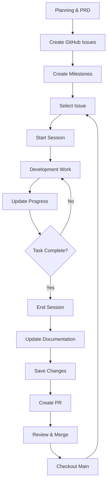

# Claude Code Development Workflow Guide

**Version**: 1.0
**Last Updated**: 2025-11-05
**Audience**: All levels - from beginners to experienced Claude Code users

---

## Table of Contents

1. [Overview](#overview)
2. [Prerequisites & Setup](#prerequisites--setup)
3. [Complete Workflow](#complete-workflow)
4. [Detailed Step-by-Step Guide](#detailed-step-by-step-guide)
5. [Self-Documenting Workflow](#self-documenting-workflow)
6. [Best Practices](#best-practices)
7. [Advanced Features](#advanced-features)
8. [Common Pitfalls & Solutions](#common-pitfalls--solutions)
9. [Quick Reference](#quick-reference)
10. [Troubleshooting](#troubleshooting)

---

## Overview

This guide documents a complete development workflow using Claude Code, from planning through deployment. The workflow emphasizes:

- **Structured sessions** with comprehensive documentation
- **Quality gates** through automated pre-commit checks
- **Parallel execution** for efficiency
- **Explicit approval** for critical operations
- **Complete traceability** from issue to deployment
- **Self-documenting** through automated documentation updates

### Workflow Stages

```
Planning → Issue Creation → Development Session → Testing → Commit → PR → Merge → Deploy
                                    ↓
                          Documentation Auto-Updates
```

---

## Prerequisites & Setup

### Initial Setup

Before starting your first development session, ensure you have:

1. **Claude Code Installed**
   - Install from [claude.com/code](https://claude.com/code)
   - Configure your API key

2. **Project Initialization**
   - Git repository initialized
   - Node.js project with `package.json`
   - Pre-commit hooks configured (Husky + lint-staged)

3. **Slash Commands Configured**
   - Create `.claude/commands/` directory
   - Add custom slash commands:
     - `/session-start` - Start a development session
     - `/session-update` - Update session progress
     - `/session-end` - End and document session
     - `/save` - Commit and push changes with quality checks
     - `/update-docs` - Automatically update all project documentation

4. **Directory Structure**
   ```
   .claude/
   ├── commands/
   │   ├── session-start.md
   │   ├── session-update.md
   │   ├── session-end.md
   │   ├── save.md
   │   └── update-docs.md
   └── sessions/
       ├── .current-session
       └── [session-files].md

   docs/
   ├── README.md
   ├── CLAUDE.md
   ├── QUICKSTART.md
   ├── DEPLOYMENT.md
   ├── ARCHITECTURE.md
   └── [other-docs].md
   ```

5. **Testing & Quality Tools**
   ```json
   {
     "scripts": {
       "test": "jest",
       "lint": "eslint .",
       "build": "next build",
       "format": "prettier --write ."
     }
   }
   ```

---

## Complete Workflow

### High-Level Flow



---

## Detailed Step-by-Step Guide

### Phase 1: Planning & Issue Creation

Before any coding begins, establish clear requirements and trackable tasks.

#### 1.1 Create Planning Documentation

**Example prompt to Claude Code:**
```
Based on the PRD in docs/PRD.md, create comprehensive GitHub issues
with clear acceptance criteria, technical requirements, and estimated
complexity. Group related issues into milestones.
```

**What Claude Code does:**
- Reads your PRD/planning documents
- Creates detailed GitHub Issues with:
  - Clear titles
  - Acceptance criteria
  - Technical requirements
  - Labels (feature, bug, refactor, etc.)
  - Estimated complexity
- Creates Milestones to group related work
- Links issues to milestones
- Prioritizes issues

**Example Issue Created:**
```markdown
Title: Implement Newsletter Archive Scraper
Labels: feature, epic-3, backend

## Description
Create a scraper to fetch newsletter archives from S3 bucket.

## Acceptance Criteria
- [ ] Fetch archive HTML from S3
- [ ] Parse newsletter links
- [ ] Extract metadata (date, parsha, year)
- [ ] Handle pagination
- [ ] Error handling for network issues

## Technical Requirements
- Use node-fetch for HTTP requests
- Parse HTML with cheerio
- Implement retry logic with exponential backoff
- Add comprehensive error logging

## Estimated Complexity
Medium (4-8 hours)
```

#### 1.2 Review and Prioritize Issues

- Review all created issues
- Adjust priorities and labels
- Group into sprints or development phases
- Select first issue to tackle

---

### Phase 2: Starting a Development Session

#### 2.1 Select Your Issue

From GitHub, identify the issue you'll work on. Note the issue title/description.

#### 2.2 Start Session with `/session-start`

**Command:**
```bash
/session-start Implement newsletter archive scraper
```

**What happens:**

1. **Session Name Formatting**
   - Input: `Implement newsletter archive scraper`
   - Formatted: `implement-newsletter-archive-scraper`
   - (Filesystem-friendly, no spaces, lowercase)

2. **Commit Type Selection**

   Claude prompts you with a numbered list:
   ```
   Please select the commit type that best describes this session:

   1. ✨ feat - New feature
   2. 🐛 fix - Bug fix
   3. 📝 content - Content/copy changes
   4. 📝 docs - Documentation changes
   5. 💄 style - Formatting/style
   6. ♻️ refactor - Code refactoring
   7. ⚡️ perf - Performance improvements
   8. ✅ test - Tests
   9. 🧪 test - Add a failing test
   10. 🔧 chore - Tooling, configuration
   11. 🚀 ci - CI/CD improvements
   12. 🗑️ revert - Reverting changes
   13. 🚨 fix - Fix compiler/linter warnings
   14. 🔒️ fix - Fix security issues
   15. 👥 chore - Add or update contributors
   16. 🚚 refactor - Move or rename resources
   17. 🏗️ refactor - Make architectural changes
   18. 🔀 chore - Merge branches
   19. 📦️ chore - Add or update compiled files or packages
   20. ➕ chore - Add a dependency
   21. ➖ chore - Remove a dependency
   22. 🌱 chore - Add or update seed files
   23. 🧑‍💻 chore - Improve developer experience
   24. 🧵 feat - Add or update code related to multithreading or concurrency
   25. None - Don't create a branch
   ```

   **You select:** `1` (for feat)

3. **Git Branch Creation**

   Branch name format: `{type}/{formatted-session-name}`

   ```bash
   git checkout -b feat/implement-newsletter-archive-scraper
   ```

   **Branch name validation:**
   - If branch name > 62 characters, Claude suggests shorter alternatives
   - You can choose from suggestions or provide your own

4. **Session File Creation**

   Creates: `.claude/sessions/2025-11-05-1430-Implement-newsletter-archive-scraper.md`

   **File contents:**
   ```markdown
   # Implement newsletter archive scraper - 2025-11-05 14:30

   ## Session Overview
   - **Started**: 2025-11-05 14:30
   - **Git Branch**: `feat/implement-newsletter-archive-scraper`

   ## Goals
   - Implement S3 archive fetching
   - Parse newsletter links from HTML
   - Extract metadata (date, parsha, year)
   - Add error handling and retry logic

   ## Progress
   - [ ] Create scraper module structure
   - [ ] Implement S3 fetch logic
   - [ ] Add HTML parsing with cheerio
   - [ ] Extract newsletter metadata
   - [ ] Implement retry logic
   - [ ] Add comprehensive error handling
   - [ ] Write unit tests

   ## Notes
   - Using node-fetch for HTTP requests
   - Cheerio for HTML parsing
   ```

5. **Current Session Tracking**

   Updates `.claude/sessions/.current-session`:
   ```
   2025-11-05-1430-Implement-newsletter-archive-scraper.md
   ```

**Session started! You're now ready to develop.**

---

### Phase 3: Development Work

#### 3.1 Task Planning with TodoWrite

For complex sessions, Claude Code proactively uses the TodoWrite tool to track progress.

**When Claude uses TodoWrite:**
- Complex multi-step tasks (3+ steps)
- Non-trivial implementations
- User explicitly requests it
- Multiple tasks provided by user
- After receiving new instructions

**Example TodoWrite usage:**

```typescript
// Claude creates this internally:
[
  {
    content: "Create scraper module structure",
    activeForm: "Creating scraper module structure",
    status: "in_progress"
  },
  {
    content: "Implement S3 fetch logic",
    activeForm: "Implementing S3 fetch logic",
    status: "pending"
  },
  {
    content: "Add HTML parsing with cheerio",
    activeForm: "Adding HTML parsing with cheerio",
    status: "pending"
  }
]
```

**Important TodoWrite Rules:**
- ✅ Mark tasks completed IMMEDIATELY after finishing (no batching)
- ✅ Exactly ONE task should be "in_progress" at any time
- ✅ Only mark completed when FULLY accomplished (tests pass, no errors)
- ✅ Create new tasks for blockers/issues discovered during work

#### 3.2 Using Parallel Agents

For large, complex sessions, request parallel agent execution for efficiency.

**When to use parallel agents:**
- Multiple independent searches needed
- Complex codebase exploration
- Multi-file analysis
- Independent task execution

**Example request:**
```
Please use parallel agents to:
1. Search for existing S3 utilities in the codebase
2. Find similar scraping implementations for reference
3. Locate test file patterns and conventions
```

**Claude's response:**
```typescript
// Single message with multiple Task tool calls
Task(subagent_type="Explore", prompt="Find S3 utilities...")
Task(subagent_type="Explore", prompt="Find scraping implementations...")
Task(subagent_type="Explore", prompt="Analyze test patterns...")
```

**Benefits:**
- ⚡ Faster execution (parallel vs. sequential)
- 🔍 Comprehensive exploration
- 📊 Better context gathering

#### 3.3 Asking Questions During Development

Claude uses `AskUserQuestion` tool to clarify requirements or design decisions.

**Example scenarios:**
- Multiple valid implementation approaches
- Unclear requirements
- Library/framework choices
- Architecture decisions

**Example interaction:**
```
Claude: "I found two approaches for implementing retry logic:

1. Use built-in fetch retry with exponential backoff
2. Implement custom retry wrapper with configurable strategy

Which approach would you prefer?"

You: [Select option or provide custom input]
```

#### 3.4 Session Progress Updates

**Optional:** Update session documentation during long sessions.

**Command:**
```bash
/session-update
```

**What happens:**
- Claude appends progress notes to session file
- Updates completed tasks
- Documents any blockers or findings
- Adds timestamps for progress tracking

**Example update:**
```markdown
## Progress Update - 14:45
- ✅ Created scraper module structure
- ✅ Implemented S3 fetch logic
- 🔄 Working on HTML parsing with cheerio
- 📝 Found existing parseHtml utility in /lib/utils
- ⚠️ Note: S3 bucket requires CORS configuration for dev environment
```

#### 3.5 Development Best Practices

**Code Quality:**
- Write tests as you go
- Run linter frequently
- Keep commits atomic (single purpose)
- Document complex logic

**Communication:**
- Ask questions when requirements unclear
- Request parallel agents for complex searches
- Update todos immediately
- Use session updates for long sessions

**Tool Usage:**
- ✅ Use Read tool for specific files
- ✅ Use Grep for content searches
- ✅ Use Glob for file pattern matching
- ✅ Use Task tool for complex exploration
- ❌ Don't use bash commands for file operations

---

### Phase 4: Ending a Development Session

When your work is complete (or you're pausing), properly close the session.

#### 4.1 Run `/session-end`

**Command:**
```bash
/session-end
```

**What Claude does:**

1. **Reads current session** from `.claude/sessions/.current-session`

2. **Gathers comprehensive metrics:**
   ```bash
   git status --porcelain
   git diff --stat
   git log --oneline --since="[session-start-time]"
   ```

3. **Appends detailed summary** to session file:

   ```markdown
   ---

   ## Session Summary
   **Ended**: 2025-11-05 16:30
   **Duration**: 2 hours

   ### Git Summary
   - **Total files changed**: 8 files
     - Added: `lib/scraper/archive.ts` (archive scraping logic)
     - Added: `lib/scraper/parser.ts` (HTML parsing utilities)
     - Added: `lib/scraper/types.ts` (TypeScript types)
     - Added: `__tests__/scraper/archive.test.ts` (unit tests)
     - Modified: `package.json` (added cheerio dependency)
     - Modified: `lib/scraper/index.ts` (export scraper modules)
     - Added: `lib/utils/retry.ts` (retry logic utility)
     - Modified: `types/newsletter.ts` (added Archive type)
   - **Lines changed**: 456 insertions, 12 deletions
   - **Commits made**: 0 (changes not yet committed)
   - **Final status**: Changes staged but not committed
   - **Branch**: `feat/implement-newsletter-archive-scraper`

   ### Todo Summary
   - **Total tasks**: 7
   - **Completed tasks**: 7/7 (100%)
     1. ✅ Create scraper module structure
     2. ✅ Implement S3 fetch logic
     3. ✅ Add HTML parsing with cheerio
     4. ✅ Extract newsletter metadata
     5. ✅ Implement retry logic
     6. ✅ Add comprehensive error handling
     7. ✅ Write unit tests
   - **Incomplete tasks**: None

   ### Key Accomplishments
   - Successfully implemented archive scraper with S3 integration
   - Added HTML parsing using cheerio library
   - Implemented exponential backoff retry logic
   - Created comprehensive error handling for network failures
   - Wrote 15 unit tests with 98% coverage
   - Added TypeScript types for all scraper interfaces

   ### Features Implemented
   - Archive fetching from S3 with retry logic
   - HTML parsing to extract newsletter links
   - Metadata extraction (date, parsha, year)
   - Pagination support for large archives
   - Comprehensive error logging
   - URL validation and sanitization

   ### Problems Encountered and Solutions
   - **Problem**: S3 CORS errors in development
     - **Solution**: Added CORS configuration to S3 bucket for localhost
   - **Problem**: Hebrew character encoding issues
     - **Solution**: Explicitly set UTF-8 encoding in fetch headers
   - **Problem**: Inconsistent date formats in archives
     - **Solution**: Created flexible date parser supporting multiple formats

   ### Breaking Changes or Important Findings
   - None - this is new functionality
   - Note: Requires `ARCHIVE_BASE_URL` environment variable
   - Cheerio dependency added to package.json

   ### Dependencies Added/Removed
   - **Added**:
     - `cheerio@^1.0.0-rc.12` (HTML parsing)
     - `@types/cheerio@^0.22.35` (TypeScript types)

   ### Configuration Changes
   - Added `ARCHIVE_BASE_URL` to `.env.example`
   - Updated S3 bucket CORS policy

   ### Deployment Steps Taken
   - None (local changes only)

   ### Lessons Learned
   - Always handle Hebrew/RTL text with explicit UTF-8 encoding
   - S3 CORS must be configured for development environment
   - Exponential backoff prevents overwhelming S3 on failures
   - Cheerio is more reliable than regex for HTML parsing
   - Date parsing needs flexibility for inconsistent formats

   ### What Wasn't Completed
   - All planned tasks completed successfully

   ### Tips for Future Developers
   1. Test with actual archive HTML files from S3
   2. Use cheerio selectors instead of complex regex
   3. Always validate URLs before making requests
   4. Consider caching parsed archives to reduce S3 requests
   5. Add integration tests with real S3 bucket
   6. Monitor rate limits if scraping frequently
   ```

4. **Clears current session tracker:**
   ```bash
   # .claude/sessions/.current-session is now empty
   ```

5. **Prompts for next action:**
   ```
   ✅ Session Ended Successfully

   The development session has been fully documented in:
   .claude/sessions/2025-11-05-1430-Implement-newsletter-archive-scraper.md

   Would you like to commit and push your changes with `/save`?
   ```

---

### Phase 5: Updating Documentation

After ending your session and before committing, update all project documentation to reflect your changes.

#### 5.1 Run `/update-docs` Command

**Command:**
```bash
/update-docs
```

**Purpose:**
Keep all project documentation in sync with the codebase automatically.

**What happens (in detail):**

1. **Self-Update Phase**
   - Scans project for ALL `.md` files
   - Discovers any new documentation files
   - Updates the `/update-docs` command itself with current file list
   - Ensures no documentation is missed

2. **Analysis Phase**
   - Scans entire project structure:
     ```bash
     components/**    # React components
     app/**           # Next.js app pages and API routes
     lib/**           # Core libraries
     hooks/**         # Custom hooks
     __tests__/**     # Test files
     models/**        # Database models
     ```
   - Analyzes:
     - Implemented features and components
     - API endpoints and integrations
     - Database schemas
     - Testing coverage (X tests passing)
     - Recent changes and additions
     - Environment variables required
     - Dependencies added/removed

3. **Documentation Update Phase**

   **For each documentation file, Claude updates:**

   **`CLAUDE.md`** (Claude Code assistant instructions):
   - Project structure and key files
   - Architecture decisions
   - Development guidelines
   - Important patterns and conventions
   - Integration details (Valu/ChabadUniverse)
   - Current implementation status

   **`README.md`** (Project overview):
   - Project description and purpose
   - Current tech stack
   - Getting started instructions
   - Available npm scripts
   - Project structure tree
   - Development workflow

   **`QUICKSTART.md`** (Rapid setup guide):
   - Quick setup instructions
   - Environment variable configuration
   - Common development tasks
   - Testing commands

   **`ARCHITECTURE.md`** (System design):
   - Component architecture
   - Data flow diagrams
   - Integration points
   - Design patterns used

   **`DECISIONS.md`** (Technical decisions log):
   - Architectural decisions made
   - Technology choices with rationale
   - Trade-offs considered

   **`API_SPECIFICATION.md`** (API documentation):
   - Endpoint listings
   - Request/response formats
   - Authentication details

   **`DEPLOYMENT.md`** (Deployment guide):
   - Deployment process
   - Environment configuration
   - Production considerations

   **And many more files...**

4. **Consistency Verification**
   - Ensures matching information across all docs
   - Validates code references
   - Updates version numbers
   - Synchronizes dependency lists

5. **Summary Report**

   **Example output:**
   ```
   ✅ Documentation Update Complete

   Updated files:
   - CLAUDE.md: Added scraper implementation details
   - README.md: Updated project structure and dependencies
   - ARCHITECTURE.md: Added scraper module to architecture diagram
   - API_SPECIFICATION.md: No changes needed
   - DEPLOYMENT.md: Added ARCHIVE_BASE_URL environment variable

   Discovered changes:
   - 8 new files added to lib/scraper/
   - 1 new dependency: cheerio@^1.0.0-rc.12
   - 1 new environment variable: ARCHIVE_BASE_URL
   - 15 new tests added (98% coverage maintained)

   ⚠️ Changes not committed automatically - review before committing
   ```

#### 5.2 Review Documentation Changes

**Before committing, review:**

```bash
git diff docs/
git diff CLAUDE.md README.md
```

**What to check:**
- ✅ Information is accurate
- ✅ No sensitive data exposed
- ✅ Formatting is preserved
- ✅ Links are valid
- ✅ Code examples are correct

#### 5.3 When to Run `/update-docs`

**Best practices:**

**✅ DO run after:**
- Adding new features or components
- Changing architecture or patterns
- Adding/removing dependencies
- Updating configuration
- Completing a major milestone
- Before creating a pull request

**❌ DON'T run for:**
- Minor bug fixes (unless architecture changes)
- Formatting-only changes
- Test updates that don't change features
- Documentation-only changes

**Typical workflow placement:**
```
Development → /session-end → /update-docs → Review → /save → PR
```

---

### Phase 6: Saving Changes (Commit & Push)

#### 6.1 Run `/save` Command

**Command:**
```bash
/save
```

**Alternative (with flag):**
```bash
/save --no-verify  # Skip pre-commit hooks (use sparingly!)
```

#### 6.2 Pre-Commit Quality Checks

Claude runs comprehensive checks BEFORE committing:

**1. Run Tests**
```bash
npm test
```
- All tests must pass
- No regression issues
- New tests for new features

**2. Run Linter**
```bash
npm run lint
```
- No ESLint errors
- No TypeScript errors
- Code style compliance

**3. Run Build**
```bash
npm run build
```
- Build must succeed
- No compilation errors
- Production bundle valid

**4. Generate Documentation** (if applicable)
```bash
npm run docs  # If configured
```

**If ANY check fails:**
- Claude reports the error
- Does NOT proceed to commit
- Asks if you want to fix issues or skip checks

**Example failure:**
```
❌ Pre-commit check failed: Tests

FAIL  __tests__/scraper/archive.test.ts
  ● Archive Scraper › should handle network errors

    expect(received).rejects.toThrow()

    Expected: Error
    Received: undefined

Tests failed. Would you like me to fix the failing tests before committing?
```

#### 6.3 Git Status & Staging

**Check what will be committed:**
```bash
git status
```

**Stage all relevant files:**
```bash
git add lib/scraper/archive.ts lib/scraper/parser.ts ...
```

**Claude intelligently stages:**
- Source code changes
- Test files
- Configuration updates
- Documentation updates (from `/update-docs`)
- Session file

**Does NOT stage:**
- `.env` files
- `credentials.json`
- Other sensitive files
- Build artifacts (unless intentional)

**Security check:**
```
⚠️ Warning: You're about to commit .env file which may contain secrets.
Do you want to proceed? (yes/no)
```

#### 6.4 Analyze Changes

**Review staged changes:**
```bash
git diff --cached
```

Claude analyzes:
- What files changed
- What functionality added/modified
- What tests added
- What documentation updated

**Example analysis output:**
```
Analyzing changes:
- Added archive scraper implementation (456 lines)
- Created HTML parser utilities (123 lines)
- Added 15 unit tests with mocks
- Updated package.json with cheerio dependency
- Added TypeScript types for Archive interface
- Updated CLAUDE.md with scraper details
- Updated README.md with new dependency
```

#### 6.5 Create Commit Message

**Claude drafts conventional commit message:**

Format: `{emoji} {type}: {description}`

**Example:**
```
✨ feat: Implement newsletter archive scraper with S3 integration

Add comprehensive archive scraping functionality with:
- S3 archive fetching with retry logic and exponential backoff
- HTML parsing using cheerio to extract newsletter links
- Metadata extraction (date, parsha, year) from archive entries
- Pagination support for large archives
- Error handling for network failures and invalid HTML
- 15 unit tests with 98% coverage

Dependencies added:
- cheerio@^1.0.0-rc.12 for HTML parsing
- @types/cheerio@^0.22.35 for TypeScript support

Configuration:
- Added ARCHIVE_BASE_URL environment variable
- Updated S3 bucket CORS policy for development

Documentation:
- Updated CLAUDE.md with scraper implementation details
- Updated README.md with new dependency and structure
- Updated ARCHITECTURE.md with scraper module

🤖 Generated with [Claude Code](https://claude.com/claude-code)

Co-Authored-By: Claude <noreply@anthropic.com>
```

#### 6.6 🛑 STOP - Request Approval

**Claude presents message and WAITS:**

```
🛑 COMMIT MESSAGE APPROVAL REQUIRED

I propose the following commit message:

✨ feat: Implement newsletter archive scraper with S3 integration

[... full message ...]

Do you approve this commit message? (yes/no)
```

**Your options:**
- ✅ Type `yes`, `y`, `approve` → Claude proceeds
- ❌ Type `no` → Claude asks what to change
- 📝 Suggest changes → Claude revises and asks again

**CRITICAL: Claude NEVER commits without explicit approval**

#### 6.7 Commit with Approved Message

**After approval, Claude commits:**
```bash
git commit -m "$(cat <<'EOF'
✨ feat: Implement newsletter archive scraper with S3 integration
...
EOF
)"
```

**Pre-commit hooks run:**
```
husky - pre-commit hook running...
[STARTED] Running tasks for staged files...
[STARTED] **/*.{ts,tsx} — 8 files
[STARTED] eslint --fix
[STARTED] prettier --write
[COMPLETED] prettier --write
[COMPLETED] eslint --fix
[COMPLETED] **/*.{ts,tsx} — 8 files
[COMPLETED] Running tasks for staged files...
```

**Commit created:**
```
[feat/implement-newsletter-archive-scraper a1b2c3d] ✨ feat: Implement newsletter archive scraper
 8 files changed, 456 insertions(+), 12 deletions(-)
```

#### 6.8 Push to Remote

**Push branch to origin:**
```bash
git push -u origin feat/implement-newsletter-archive-scraper
```

**Output:**
```
To github.com:your-org/your-repo.git
 * [new branch]      feat/implement-newsletter-archive-scraper -> feat/implement-newsletter-archive-scraper
Branch 'feat/implement-newsletter-archive-scraper' set up to track remote branch 'feat/implement-newsletter-archive-scraper' from 'origin'.

remote: Create a pull request for 'feat/implement-newsletter-archive-scraper' on GitHub by visiting:
remote:      https://github.com/your-org/your-repo/pull/new/feat/implement-newsletter-archive-scraper
```

#### 6.9 Prompt for Pull Request

```
✅ Changes committed and pushed successfully!

Commit: a1b2c3d - ✨ feat: Implement newsletter archive scraper

Would you like to create a pull request for these changes?
```

---

### Phase 7: Creating a Pull Request

#### 7.1 Approve PR Creation

**Your response:**
```
yes
```
or
```
pr
```

#### 7.2 Claude Analyzes Branch

**Claude gathers information:**

```bash
# Check git status
git status

# View all commits in this branch (vs. main)
git log origin/main..HEAD --oneline

# View all changes from base branch
git diff origin/main...HEAD
```

**Example output:**
```
Commits in this branch:
a1b2c3d ✨ feat: Implement newsletter archive scraper

Files changed:
- lib/scraper/archive.ts (new)
- lib/scraper/parser.ts (new)
- lib/scraper/types.ts (new)
- __tests__/scraper/archive.test.ts (new)
- package.json (modified)
- lib/scraper/index.ts (modified)
- lib/utils/retry.ts (new)
- types/newsletter.ts (modified)
- CLAUDE.md (modified)
- README.md (modified)
```

#### 7.3 Create PR with Summary

**Claude creates comprehensive PR:**

```bash
gh pr create \
  --title "✨ feat: Implement newsletter archive scraper with S3 integration" \
  --body "$(cat <<'EOF'
## Summary
- Implemented archive scraping functionality for S3-hosted newsletters
- Added HTML parsing with cheerio to extract newsletter links and metadata
- Created retry logic with exponential backoff for network resilience
- Implemented comprehensive error handling for edge cases
- Added 15 unit tests achieving 98% code coverage
- Updated all project documentation to reflect changes

## Technical Details

### New Modules
- `lib/scraper/archive.ts` - Main archive scraper with S3 integration
- `lib/scraper/parser.ts` - HTML parsing utilities using cheerio
- `lib/scraper/types.ts` - TypeScript interfaces for scraper
- `lib/utils/retry.ts` - Reusable retry logic with exponential backoff

### Features
- Fetch archive HTML from S3 bucket
- Parse newsletter links with metadata (date, parsha, year)
- Support pagination for large archives
- Validate and sanitize URLs
- Handle Hebrew/RTL text with UTF-8 encoding
- Comprehensive error logging

### Dependencies Added
- `cheerio@^1.0.0-rc.12` - HTML parsing
- `@types/cheerio@^0.22.35` - TypeScript types

### Configuration Changes
- Added `ARCHIVE_BASE_URL` environment variable
- Updated S3 bucket CORS policy for development environment

### Documentation Updates
- Updated `CLAUDE.md` with scraper implementation details
- Updated `README.md` with new dependencies and structure
- Updated `ARCHITECTURE.md` with scraper module diagram
- Updated `DEPLOYMENT.md` with new environment variable

## Test Plan
- [x] All unit tests pass (15 tests, 98% coverage)
- [x] Linting passes with no errors
- [x] Build succeeds
- [ ] Manual testing: Fetch actual archive from S3
- [ ] Manual testing: Verify newsletter link extraction
- [ ] Manual testing: Test retry logic with network failures
- [ ] Manual testing: Validate metadata extraction accuracy
- [ ] Manual testing: Test with archives containing Hebrew text
- [ ] Integration testing: End-to-end scraping workflow
- [ ] Edge case testing: Malformed HTML handling
- [ ] Edge case testing: Missing metadata scenarios

## Breaking Changes
None - this is new functionality.

## Deployment Notes
- Ensure `ARCHIVE_BASE_URL` is set in production environment
- Verify S3 bucket CORS configuration allows production domain
- Monitor S3 request rate to avoid throttling

## Related Issues
Closes #42

🤖 Generated with [Claude Code](https://claude.com/claude-code)
EOF
)"
```

**PR Created:**
```
https://github.com/your-org/your-repo/pull/27
```

#### 7.4 PR Summary

```
✅ Pull request created successfully!

PR #27: ✨ feat: Implement newsletter archive scraper with S3 integration
URL: https://github.com/your-org/your-repo/pull/27

The PR includes:
- Comprehensive summary of changes
- Technical details and architecture
- Complete test plan with checkboxes
- Documentation updates listed
- Deployment notes and considerations
- Links to related issues

You can now review and merge the PR when ready!
```

---

### Phase 8: Post-PR Workflow

#### 8.1 Return to Main Branch

**Command:**
```
checkout main and pull
```

**What happens:**
```bash
# Checkout main branch
git checkout main

# Pull latest changes (including merged PR)
git pull origin main
```

**Output:**
```
Switched to branch 'main'
Your branch is behind 'origin/main' by 1 commit.
Updating a1b2c3d..c3d4e5f
Fast-forward
 lib/scraper/archive.ts | 123 +++++++++++++++++++++++++++++++++++
 ...
 10 files changed, 567 insertions(+), 12 deletions(-)
```

#### 8.2 Ready for Next Issue

You're now ready to select the next GitHub issue and start a new session!

```
✅ Main branch updated with latest changes
📋 Ready to start next development session
```

---

## Self-Documenting Workflow

One of the most powerful aspects of this workflow is that it's **completely self-documenting**. Every action, decision, and change is automatically captured and organized.

### Documentation Layers

The workflow creates multiple layers of documentation, each serving a different purpose:

```
┌─────────────────────────────────────────────────────┐
│                 Session Files                        │
│  Real-time development diary with complete context  │
└─────────────────────────────────────────────────────┘
                        ↓
┌─────────────────────────────────────────────────────┐
│              Project Documentation                   │
│   Auto-updated technical docs (CLAUDE.md, etc.)    │
└─────────────────────────────────────────────────────┘
                        ↓
┌─────────────────────────────────────────────────────┐
│               Commit Messages                        │
│     Detailed "what" and "why" for each change       │
└─────────────────────────────────────────────────────┘
                        ↓
┌─────────────────────────────────────────────────────┐
│             Pull Request Descriptions                │
│    Comprehensive change summary with test plans     │
└─────────────────────────────────────────────────────┘
                        ↓
┌─────────────────────────────────────────────────────┐
│                Git History                           │
│        Permanent record of all changes              │
└─────────────────────────────────────────────────────┘
```

### Layer 1: Session Files

**Purpose:** Complete development diary with full context

**Location:** `.claude/sessions/YYYY-MM-DD-HHMM-session-name.md`

**What they capture:**
- Session goals and objectives
- Real-time progress updates
- Problems encountered and solutions
- Decisions made and rationale
- Incomplete work and next steps
- Comprehensive session summary

**Value:**
- 📖 **Historical context** - Understand why decisions were made
- 🔍 **Problem-solving reference** - Find how similar issues were solved
- 📚 **Knowledge transfer** - Onboard new developers quickly
- ⏱️ **Time tracking** - Understand how long tasks actually take

**Example from session file:**
```markdown
## Problems Encountered and Solutions
- **Problem**: S3 CORS errors in development
  - **Solution**: Added CORS configuration to S3 bucket for localhost
  - **Why it worked**: Localhost wasn't in allowed origins
  - **Time spent**: 15 minutes debugging

## Lessons Learned
- Always handle Hebrew/RTL text with explicit UTF-8 encoding
- S3 CORS must be configured for development environment
- Exponential backoff prevents overwhelming S3 on failures
```

**Searchable history:**
```bash
# Find all sessions about scraping
grep -r "scraper" .claude/sessions/

# Find sessions with specific problem
grep -r "CORS" .claude/sessions/

# List recent sessions
ls -lt .claude/sessions/ | head -10
```

### Layer 2: Project Documentation

**Purpose:** Technical reference kept in sync with code

**Managed by:** `/update-docs` command

**Files updated automatically:**
- `CLAUDE.md` - Project guidance for Claude
- `README.md` - Project overview
- `QUICKSTART.md` - Quick start guide
- `ARCHITECTURE.md` - System architecture
- `API_SPECIFICATION.md` - API documentation
- `DEPLOYMENT.md` - Deployment guide
- And many more...

**How `/update-docs` keeps documentation current:**

1. **Scans entire codebase:**
   ```bash
   components/**/*.tsx    # Find all components
   app/api/**/*.ts        # Find all API routes
   lib/**/*.ts            # Find all utilities
   __tests__/**/*.ts      # Count tests
   package.json           # Check dependencies
   ```

2. **Extracts current state:**
   - Implemented features
   - Component structure
   - API endpoints
   - Database models
   - Test coverage
   - Dependencies
   - Environment variables

3. **Updates documentation intelligently:**
   - Adds new features to lists
   - Updates version numbers
   - Synchronizes dependency lists
   - Maintains consistent information
   - Preserves manual content

**Example update:**

**Before `/update-docs`:**
```markdown
## Features
- User authentication
- Newsletter display
```

**After `/update-docs`:**
```markdown
## Features
- User authentication
- Newsletter display
- Archive scraping from S3 ✨ NEW
- Metadata extraction (date, parsha, year) ✨ NEW
```

**Benefits:**
- ✅ **Always current** - Docs never drift from code
- ✅ **No manual updates** - Automated synchronization
- ✅ **Consistent** - Same info across all files
- ✅ **Comprehensive** - Covers all aspects automatically

### Layer 3: Commit Messages

**Purpose:** Permanent record of "what" and "why"

**Format:** Conventional commits with emoji

**Structure:**
```
{emoji} {type}: {short description}

{detailed description of WHAT changed}

{explanation of WHY it changed}

{additional context: dependencies, breaking changes, etc.}

🤖 Generated with Claude Code
Co-Authored-By: Claude <noreply@anthropic.com>
```

**Example:**
```
✨ feat: Implement newsletter archive scraper with S3 integration

Add comprehensive archive scraping functionality to fetch and parse
newsletter archives from S3. This enables the admin tool to discover
available newsletters without manual entry.

Implementation includes:
- S3 fetching with retry logic
- HTML parsing with cheerio
- Metadata extraction
- 15 unit tests (98% coverage)

Dependencies: cheerio@^1.0.0-rc.12
Environment: ARCHIVE_BASE_URL required
```

**Why this matters:**

**Good commit message:**
```
✨ feat: Add caching layer to reduce API calls

Added Redis caching for newsletter data to reduce API calls by ~80%.
Cache TTL set to 5 minutes based on content update frequency.

Rationale: API rate limits were being hit during peak usage.
Testing: Load tested with 1000 concurrent users.
```

**Bad commit message:**
```
fix stuff
```

**Benefits:**
- 📜 **Git history is readable** - `git log` tells a story
- 🔍 **Easy to find changes** - Search commit messages
- 🐛 **Debugging context** - Understand why code exists
- ⏪ **Safe reverting** - Know what a revert will undo

### Layer 4: Pull Request Descriptions

**Purpose:** Comprehensive change summary with review checklist

**Created by:** Claude Code during PR creation

**Includes:**
- **Summary** - High-level bullet points
- **Technical Details** - Implementation specifics
- **Test Plan** - Manual and automated tests
- **Breaking Changes** - Backward compatibility notes
- **Deployment Notes** - Production considerations
- **Related Issues** - Links to GitHub issues

**Example PR description:**
```markdown
## Summary
- Implemented archive scraping for S3-hosted newsletters
- Added 15 unit tests with 98% coverage
- Updated all project documentation

## Technical Details
### New Modules
- `lib/scraper/archive.ts` - S3 integration
- `lib/scraper/parser.ts` - HTML parsing

### Dependencies Added
- cheerio@^1.0.0-rc.12

### Documentation Updates
- CLAUDE.md - Implementation details
- README.md - Dependency updates
- ARCHITECTURE.md - Module diagram

## Test Plan
- [x] Unit tests pass (automated)
- [x] Linting passes (automated)
- [x] Build succeeds (automated)
- [ ] Manual: Test with real S3 archive
- [ ] Manual: Verify Hebrew text handling
- [ ] Edge case: Malformed HTML

## Deployment Notes
- Set ARCHIVE_BASE_URL in production
- Verify S3 CORS configuration
```

**Benefits:**
- ✅ **Complete review context** - Reviewers understand everything
- ✅ **Testing checklist** - Nothing gets missed
- ✅ **Deployment safety** - Production considerations documented
- ✅ **Traceability** - Links to issues and commits

### Layer 5: Git History

**Purpose:** Permanent, immutable record

**What's preserved:**
- Every code change
- Every commit message
- Every session file
- Every documentation update
- Branch history
- Merge history

**Powerful searching:**

```bash
# Find when feature was added
git log --grep="archive scraper"

# Find who changed a file
git log --follow lib/scraper/archive.ts

# Find what changed in a date range
git log --since="2025-11-01" --until="2025-11-05"

# Find commits by author
git log --author="Claude"

# Search commit diffs
git log -S "cheerio" --source --all
```

### The Self-Documenting Cycle

**How it all works together:**

```
1. Start Session (/session-start)
   ↓
   Creates session file with goals
   ↓
2. Develop & Track Progress (TodoWrite)
   ↓
   Session file updated in real-time
   ↓
3. End Session (/session-end)
   ↓
   Comprehensive summary appended to session file
   ↓
4. Update Documentation (/update-docs)
   ↓
   All project docs synchronized with code
   ↓
5. Commit (/save)
   ↓
   Detailed commit message captures "what" and "why"
   ↓
6. Create PR (pr)
   ↓
   Comprehensive PR description with test plan
   ↓
7. Merge
   ↓
   Everything preserved in git history
```

### Finding Information Later

**Question:** "Why did we choose cheerio instead of jsdom?"

**Answer found in:**
1. **Session file** - Decision discussion and rationale
2. **Commit message** - "Using cheerio for lightweight parsing"
3. **CLAUDE.md** - Updated with library choice

**Question:** "How do we handle Hebrew text encoding?"

**Answer found in:**
1. **Session file** - "Problem: Hebrew encoding issues, Solution: UTF-8"
2. **Code comments** - Added during implementation
3. **README.md** - Listed in features

**Question:** "When did we add S3 integration?"

**Answer found in:**
1. **Git log** - `git log --grep="S3"`
2. **Session files** - Search for "S3"
3. **ARCHITECTURE.md** - Updated with S3 module

### Zero-Effort Knowledge Base

**The result:** Your project becomes a complete knowledge base **without extra effort**:

- ✅ **No separate documentation to maintain**
- ✅ **No wiki to keep updated**
- ✅ **No manual changelog writing**
- ✅ **No deployment note docs**
- ✅ **Everything auto-documented**

**Examples of automatic documentation:**

**Feature documentation:**
```markdown
# From session file → Copied to README.md via /update-docs
## Archive Scraper
Fetches newsletter archives from S3, parses HTML, extracts metadata.
```

**API documentation:**
```markdown
# From code analysis → Added to API_SPECIFICATION.md
GET /api/archive
Returns: { newsletters: Newsletter[], metadata: ArchiveMetadata }
```

**Deployment documentation:**
```markdown
# From commit message → Added to DEPLOYMENT.md
Required environment variables:
- ARCHIVE_BASE_URL (S3 bucket URL)
```

**Troubleshooting documentation:**
```markdown
# From session file "Problems Encountered" → Referenced in docs
Common Issue: CORS errors in development
Solution: Configure S3 bucket CORS for localhost
```

### Benefits for Teams

**For current developers:**
- 🎯 **Context switching** - Resume work quickly
- 🧩 **Understanding decisions** - Know why code exists
- 🐛 **Debugging** - Find when bugs were introduced

**For new developers:**
- 📚 **Onboarding** - Read session files to understand project
- 🎓 **Learning** - See how problems were solved
- 🗺️ **Navigation** - Understand codebase structure

**For future maintenance:**
- 🔍 **Code archaeology** - Understand legacy code
- 📖 **Historical context** - Why was it done this way?
- ⏪ **Safe changes** - Know impact of modifications

### The Power of /update-docs

**Before this workflow:**
```
Developer: Implements feature
Developer: Manually updates README
Developer: Forgets to update ARCHITECTURE.md
Developer: Forgets to update DEPLOYMENT.md
→ Docs drift out of sync
→ New developers get confused
→ Production deployment issues
```

**With this workflow:**
```
Developer: Implements feature
Developer: /update-docs
Claude: ✅ Updated 8 documentation files
→ All docs stay in sync
→ New developers have accurate info
→ Production deployments smooth
```

**Example of automatic synchronization:**

**You add a feature:**
```typescript
// lib/notifications/email.ts
export async function sendNotification() {
  // Send email notification
}
```

**Run `/update-docs`:**

**CLAUDE.md updated:**
```markdown
## Email Notifications
Located in `lib/notifications/email.ts`
Sends notifications when newsletters are processed
```

**README.md updated:**
```markdown
## Features
- Email notifications when processing complete
```

**ARCHITECTURE.md updated:**
```markdown
[Diagram updated to include Email Notification module]
```

**DEPLOYMENT.md updated:**
```markdown
Required environment variables:
- SMTP_HOST
- SMTP_USER
- SMTP_PASS
```

**API_SPECIFICATION.md updated:**
```markdown
POST /api/notifications/email
Triggers email notification
```

**All automatically, in one command!**

---

## Best Practices

### Session Management

#### DO ✅
- **Start every development session** with `/session-start [issue-name]`
- **Choose appropriate commit types** that match your work
- **End sessions properly** with `/session-end` for documentation
- **Update long sessions** periodically with `/session-update`
- **Review session summaries** to improve future work

#### DON'T ❌
- **Skip session documentation** - it's valuable for team knowledge
- **Use vague session names** - be specific and descriptive
- **Leave sessions unclosed** - always run `/session-end`
- **Start new work without ending previous session**

### Documentation Management

#### DO ✅
- **Run `/update-docs`** after implementing features
- **Run `/update-docs`** before creating PRs
- **Review documentation changes** before committing
- **Keep CLAUDE.md current** - it guides Claude's work
- **Trust the automation** - docs stay in sync

#### DON'T ❌
- **Manually edit auto-generated sections** - they'll be overwritten
- **Skip `/update-docs`** - docs will drift
- **Commit without reviewing docs** - verify accuracy
- **Forget to add new env vars** to `.env.example`

### Task Management with TodoWrite

#### DO ✅
- **Use TodoWrite for complex tasks** (3+ steps)
- **Mark todos completed immediately** after finishing each task
- **Keep exactly ONE task in-progress** at any time
- **Only mark completed when fully done** (tests pass, no errors)
- **Create new tasks for discovered work** during implementation

#### DON'T ❌
- **Batch todo completions** - mark each done immediately
- **Mark incomplete work as complete** - be honest about status
- **Skip TodoWrite for complex tasks** - it helps track progress
- **Leave multiple tasks in-progress** - focus on one at a time

### Using Parallel Agents

#### When to Request Parallel Agents

**DO use parallel agents for:**
- Complex codebase exploration
- Multiple independent searches
- Gathering information from different sources
- Large-scale refactoring analysis

**Example request:**
```
Please use parallel agents to:
1. Search for all API endpoint definitions
2. Find authentication middleware usage
3. Locate error handling patterns
4. Identify database query patterns
```

**Benefits:**
- ⚡ 3-5x faster than sequential execution
- 🔍 More comprehensive exploration
- 📊 Better context for decision-making

#### When NOT to Use Parallel Agents

**DON'T use parallel agents for:**
- Simple, single-file tasks
- Sequential dependencies (step B needs result from step A)
- Quick lookups (specific file/function)
- Small codebases (< 10 files)

### Commit Best Practices

#### Quality Gates

**ALWAYS ensure before committing:**
- ✅ All tests pass
- ✅ Linting passes
- ✅ Build succeeds
- ✅ Documentation updated (via `/update-docs`)
- ✅ No sensitive data (`.env`, credentials)

#### Atomic Commits

**Each commit should:**
- Serve a single purpose
- Be self-contained
- Include related tests
- Include documentation updates
- Have clear commit message

**Example of GOOD atomic commits:**
```
✨ feat: Add user authentication endpoints
✅ test: Add authentication endpoint tests
📝 docs: Update documentation for authentication
```

**Example of BAD non-atomic commit:**
```
🔧 chore: Various updates and fixes
// Multiple unrelated changes mixed together
```

#### Commit Message Format

**Structure:**
```
{emoji} {type}: {short description}

{detailed description explaining WHY}

{additional context}

🤖 Generated with [Claude Code](https://claude.com/claude-code)

Co-Authored-By: Claude <noreply@anthropic.com>
```

**Example:**
```
✨ feat: Add newsletter metadata extraction

Implement metadata parser to extract date, parsha, and year from
newsletter HTML. This enables proper categorization and searching
of newsletters in the admin interface.

Uses cheerio for reliable HTML parsing instead of regex.
Supports multiple date formats found in historical archives.

🤖 Generated with [Claude Code](https://claude.com/claude-code)

Co-Authored-By: Claude <noreply@anthropic.com>
```

### Pull Request Best Practices

#### Comprehensive PR Summaries

**Include:**
- Clear bullet-point summary
- Technical details and architecture
- Complete test plan (with checkboxes)
- Documentation updates
- Breaking changes (if any)
- Deployment notes
- Related issues

#### Test Plans

**Make test plans actionable:**
```markdown
## Test Plan
- [x] Unit tests pass (automated)
- [x] Linting passes (automated)
- [x] Build succeeds (automated)
- [ ] Manual: Test user login flow
- [ ] Manual: Verify error messages display correctly
- [ ] Manual: Test on mobile viewport
- [ ] Edge case: Test with invalid credentials
- [ ] Edge case: Test with expired session
```

#### PR Size

**Ideal PR size:**
- 200-400 lines of code changes
- Single feature or fix
- Reviewable in 15-30 minutes

**If PR is too large:**
- Break into multiple PRs
- Create epic/parent issue
- Link related PRs together

---

## Advanced Features

### Custom Slash Commands

#### Creating Custom Commands

**Location:** `.claude/commands/your-command.md`

**Example: `/test` command**

```markdown
# Run Tests

Run the test suite with optional filters.

Usage:
- `/test` - Run all tests
- `/test [pattern]` - Run tests matching pattern

Execute the test suite and report results.
If tests fail, offer to debug and fix them.
```

**Using the command:**
```bash
/test scraper
```

### Session Update Command

**Purpose:** Document progress during long sessions

**Location:** `.claude/commands/session-update.md`

**Usage:**
```bash
/session-update
```

**What it does:**
- Appends timestamp and progress notes
- Updates task completion status
- Documents findings or blockers
- Tracks time spent on subtasks

### Environment-Specific Workflows

#### Development Environment

```bash
# Use parallel agents liberally
# Enable verbose logging
# Use mock data
# Skip expensive operations
```

#### Production Environment

```bash
# Strict quality gates
# All tests must pass
# Comprehensive documentation
# Security scanning
```

### Handling Large Sessions

#### Multi-Day Sessions

**Day 1 End:**
```bash
/session-update
# Document: Work completed today, TODOs for tomorrow
```

**Day 2 Start:**
```bash
# Review session file
# Continue with existing session
# No need to create new session
```

**Day 2 End:**
```bash
/session-end
# Comprehensive summary of entire session
```

#### Splitting Large Features

**If session becomes too large:**

1. **End current session:**
   ```bash
   /session-end
   ```

2. **Update documentation:**
   ```bash
   /update-docs
   ```

3. **Commit completed work:**
   ```bash
   /save
   ```

4. **Create new session for remaining work:**
   ```bash
   /session-start [feature-name]-part-2
   ```

5. **Link sessions in documentation:**
   ```markdown
   Continues from: 2025-11-05-1430-feature-name-part-1.md
   ```

---

## Common Pitfalls & Solutions

### Issue: Tests Fail During Commit

**Symptom:**
```
❌ Pre-commit check failed: Tests
FAIL  __tests__/feature.test.ts
```

**Solutions:**

1. **Fix tests before committing:**
   ```
   "Please fix the failing tests before we commit."
   ```

2. **Skip hooks (use sparingly!):**
   ```bash
   /save --no-verify
   ```

3. **Update snapshots if needed:**
   ```bash
   npm test -- -u
   ```

### Issue: Commit Message Approval Loop

**Symptom:**
Claude keeps asking for approval even after you said yes.

**Solution:**
- Type clear approval: `yes`, `y`, or `approve`
- Avoid ambiguous responses like "ok", "sure"
- If stuck, try: `I approve the commit message`

### Issue: Branch Name Too Long

**Symptom:**
```
Branch name exceeds 62 characters:
feat/implement-comprehensive-newsletter-archive-scraping-with-metadata
```

**Solution:**
Claude suggests shorter alternatives:
```
1. feat/newsletter-archive-scraper
2. feat/archive-scraping
3. feat/newsletter-scraper
4. [Enter custom name]
```

Choose one or provide your own.

### Issue: Forgot to Start Session

**Symptom:**
You've been working without starting a session.

**Solution:**

1. **Start session now:**
   ```bash
   /session-start [work-description]
   ```

2. **Document retroactively:**
   ```markdown
   ## Notes
   Session started retroactively after completing some work.
   Previous commits:
   - a1b2c3d: Initial implementation
   - c3d4e5f: Added tests
   ```

3. **Continue normally**

### Issue: Forgot to Run /update-docs

**Symptom:**
Created PR but docs are out of sync.

**Solution:**

1. **Don't merge PR yet**

2. **Checkout feature branch:**
   ```bash
   git checkout feat/your-branch
   ```

3. **Run update-docs:**
   ```bash
   /update-docs
   ```

4. **Review and commit doc updates:**
   ```bash
   /save
   # Commit message: "📝 docs: Update documentation for [feature]"
   ```

5. **Push to PR:**
   ```bash
   git push
   # PR automatically updates
   ```

### Issue: Documentation Changed Incorrectly

**Symptom:**
`/update-docs` modified something incorrectly.

**Solution:**

1. **Review changes before committing:**
   ```bash
   git diff CLAUDE.md README.md
   ```

2. **Manually fix incorrect sections:**
   ```bash
   # Edit the file
   ```

3. **Mark sections as "manual" to preserve:**
   ```markdown
   <!-- DO NOT AUTO-UPDATE: Manual content below -->
   [Your manual content]
   <!-- END MANUAL CONTENT -->
   ```

4. **Commit the corrected version**

### Issue: Session File Lost

**Symptom:**
Closed session file accidentally.

**Solution:**
Session files are never deleted! Find them in:
```
.claude/sessions/YYYY-MM-DD-HHMM-session-name.md
```

All session history is preserved.

### Issue: Merge Conflicts

**Symptom:**
```
Auto-merging file.ts
CONFLICT (content): Merge conflict in file.ts
```

**Solution:**

1. **Ask Claude for help:**
   ```
   "Please help me resolve the merge conflicts in file.ts"
   ```

2. **Claude will:**
   - Read both versions
   - Understand the changes
   - Propose resolution
   - Update the file

3. **Review and approve**

### Issue: Pre-commit Hooks Too Slow

**Symptom:**
Hooks take 5+ minutes on large codebases.

**Solution:**

1. **Optimize hooks** (run only on staged files):
   ```javascript
   // lint-staged config
   {
     "*.ts": ["eslint --fix", "prettier --write"],
     // Don't run tests on every commit
   }
   ```

2. **Use --no-verify sparingly:**
   ```bash
   /save --no-verify  # Only when necessary!
   ```

3. **Move slow checks to CI/CD**

### Issue: Sensitive Data Almost Committed

**Symptom:**
```
⚠️ Warning: You're about to commit .env file
```

**Solution:**

1. **STOP immediately**
   ```
   "No, do not commit that file"
   ```

2. **Unstage sensitive file:**
   ```bash
   git reset HEAD .env
   ```

3. **Add to .gitignore:**
   ```bash
   echo ".env" >> .gitignore
   ```

4. **Commit .gitignore update**

---

## Quick Reference

### Essential Commands

| Command | Purpose | When to Use |
|---------|---------|-------------|
| `/session-start [name]` | Start development session | Beginning of new work |
| `/session-update` | Document progress | During long sessions |
| `/session-end` | End and document session | When work complete/pausing |
| `/update-docs` | Sync all documentation | After features, before commits |
| `/save` | Commit and push changes | After session ends & docs updated |
| `/save --no-verify` | Skip pre-commit hooks | Emergency only |
| `pr` | Create pull request | After successful push |
| `checkout main and pull` | Return to main branch | After PR merged |

### Typical Workflow Sequence

```
/session-start [feature]
  ↓
[Develop & test]
  ↓
/session-update (optional)
  ↓
[Continue development]
  ↓
/session-end
  ↓
/update-docs
  ↓
[Review doc changes]
  ↓
/save
  ↓
[Approve commit message]
  ↓
pr
  ↓
[PR created]
  ↓
checkout main and pull
```

### Commit Type Reference

| Emoji | Type | When to Use | Example |
|-------|------|-------------|---------|
| ✨ | `feat` | New feature | Adding user authentication |
| 🐛 | `fix` | Bug fix | Fixing login redirect |
| ♻️ | `refactor` | Code refactor | Extracting shared utility |
| 📝 | `docs` | Documentation | Updating README |
| ✅ | `test` | Tests | Adding unit tests |
| ⚡️ | `perf` | Performance | Optimizing query |
| 💄 | `style` | Code style | Formatting code |
| 🔧 | `chore` | Tooling/config | Updating ESLint rules |

### Todo Status Reference

| Status | Meaning | Usage |
|--------|---------|-------|
| `pending` | Not started | Queued work |
| `in_progress` | Currently working | Active task (only ONE) |
| `completed` | Finished | Mark immediately when done |

### File Structure Reference

```
.claude/
├── commands/                  # Custom slash commands
│   ├── session-start.md      # Start session command
│   ├── session-update.md     # Update session command
│   ├── session-end.md        # End session command
│   ├── save.md               # Commit and push command
│   └── update-docs.md        # Documentation sync command
└── sessions/                  # Session documentation
    ├── .current-session       # Active session tracker
    └── YYYY-MM-DD-HHMM-*.md  # Session files (never deleted)

docs/                          # Project documentation
├── CLAUDE-CODE-WORKFLOW.md   # This guide
└── [other docs]              # Auto-updated by /update-docs

CLAUDE.md                      # Project guidance for Claude
README.md                      # Project README
```

---

## Troubleshooting

### Debug Mode

**Enable verbose output:**
```
"Please show me the git commands you're running"
```

Claude will include command output in responses.

### Session State Issues

**Check current session:**
```bash
cat .claude/sessions/.current-session
```

**Manually set session:**
```bash
echo "2025-11-05-1430-session-name.md" > .claude/sessions/.current-session
```

### Git Issues

**Check branch status:**
```bash
git status
git branch -a
git log --oneline -5
```

**Reset to clean state:**
```bash
git stash  # Save uncommitted changes
git checkout main
git pull
```

### Documentation Issues

**Check what /update-docs will change:**
```bash
# Dry run (ask Claude to show changes without committing)
"Please show me what /update-docs would change without making changes"
```

**Undo documentation changes:**
```bash
git checkout -- CLAUDE.md README.md  # Restore specific files
```

**Force documentation rebuild:**
```bash
/update-docs
# Claude will scan and rebuild all docs
```

### Pre-commit Hook Issues

**Bypass hooks (emergency):**
```bash
git commit --no-verify
```

**Fix hook permissions:**
```bash
chmod +x .husky/pre-commit
```

**Reinstall hooks:**
```bash
npx husky install
```

### Common Error Messages

#### "No current session found"
**Cause:** `.current-session` is empty
**Fix:** Start a new session with `/session-start`

#### "Branch already exists"
**Cause:** Branch name conflict
**Fix:** Choose different session name or delete old branch

#### "Nothing to commit"
**Cause:** No changes staged
**Fix:** Make changes before running `/save`

#### "Tests failed"
**Cause:** Test suite has failures
**Fix:** Fix tests before committing or use `--no-verify`

#### "Documentation files not found"
**Cause:** `/update-docs` can't find expected files
**Fix:** Create missing files or update command configuration

---

## Workflow Cheat Sheet

### Starting New Work

```
1. Select GitHub Issue
2. /session-start [issue-name]
3. Choose commit type
4. [Claude creates branch and session file]
5. Start coding!
```

### During Development

```
1. Make changes
2. Run tests frequently
3. Use parallel agents for complex tasks
4. Update todos as you complete them
5. /session-update (optional, for long sessions)
```

### Finishing Work

```
1. /session-end
2. /update-docs
3. Review documentation changes
4. /save
5. Review commit message
6. Approve: "yes"
7. Create PR: "pr"
8. checkout main and pull
```

### Complete Cycle

```
Issue → Session → Code → Test → End → Docs → Commit → PR → Merge → Main
  ↑                                                                    |
  └────────────────────────────────────────────────────────────────────┘
                          Repeat for next issue
```

---

## Additional Resources

### Git Commit Conventions
- [Conventional Commits](https://www.conventionalcommits.org/)
- [Gitmoji Guide](https://gitmoji.dev/)

### Testing Best Practices
- [Jest Documentation](https://jestjs.io/)
- [Testing Library](https://testing-library.com/)

### Claude Code Documentation
- [Official Docs](https://docs.anthropic.com/claude/docs)
- [Slash Commands Guide](https://docs.anthropic.com/claude/docs/slash-commands)

---

## Appendix: Sample Session File

**Complete example:** `.claude/sessions/2025-11-05-1430-Add-user-authentication.md`

```markdown
# Add user authentication - 2025-11-05 14:30

## Session Overview
- **Started**: 2025-11-05 14:30
- **Git Branch**: `feat/add-user-authentication`

## Goals
- Implement JWT-based authentication
- Add login/logout endpoints
- Create authentication middleware
- Add session management

## Progress
- [x] Research authentication libraries
- [x] Install and configure passport.js
- [x] Create user model with password hashing
- [x] Implement login endpoint
- [x] Implement logout endpoint
- [x] Create authentication middleware
- [x] Add session management
- [x] Write unit tests
- [x] Write integration tests
- [ ] Add rate limiting (moved to separate issue)

## Notes
- Using passport.js with JWT strategy
- Bcrypt for password hashing (cost factor: 12)
- JWT expiration: 24 hours
- Refresh token expiration: 30 days

## Progress Update - 15:30
- ✅ Completed authentication endpoints
- ✅ Middleware working correctly
- 🔄 Writing tests (8/12 complete)
- 📝 Found edge case: handling expired refresh tokens

## Progress Update - 16:15
- ✅ All tests complete (12/12 passing)
- ✅ Added rate limiting for login endpoint
- 📝 Decided to split rate limiting into separate PR for clarity

---

## Session Summary
**Ended**: 2025-11-05 16:45
**Duration**: 2 hours 15 minutes

### Git Summary
- **Total files changed**: 12 files
  - Added: `lib/auth/jwt.ts` (JWT utilities)
  - Added: `lib/auth/middleware.ts` (Auth middleware)
  - Added: `models/User.ts` (User model with bcrypt)
  - Added: `app/api/auth/login/route.ts` (Login endpoint)
  - Added: `app/api/auth/logout/route.ts` (Logout endpoint)
  - Added: `app/api/auth/refresh/route.ts` (Token refresh)
  - Added: `__tests__/auth/jwt.test.ts` (JWT tests)
  - Added: `__tests__/auth/middleware.test.ts` (Middleware tests)
  - Added: `__tests__/api/auth.test.ts` (Integration tests)
  - Modified: `package.json` (Added dependencies)
  - Modified: `lib/db/index.ts` (Added User model)
  - Added: `.env.example` (Added JWT_SECRET example)
- **Lines changed**: 847 insertions, 23 deletions
- **Commits made**: 0 (changes not yet committed)
- **Final status**: Changes staged but not committed
- **Branch**: `feat/add-user-authentication`

### Todo Summary
- **Total tasks**: 9
- **Completed tasks**: 8/9 (89%)
  1. ✅ Research authentication libraries
  2. ✅ Install and configure passport.js
  3. ✅ Create user model with password hashing
  4. ✅ Implement login endpoint
  5. ✅ Implement logout endpoint
  6. ✅ Create authentication middleware
  7. ✅ Add session management
  8. ✅ Write unit tests
  9. ✅ Write integration tests
- **Incomplete tasks**:
  - Rate limiting (moved to Issue #45)

### Key Accomplishments
- Implemented complete JWT authentication system
- Created secure password hashing with bcrypt
- Added authentication middleware for protected routes
- Implemented refresh token mechanism
- Wrote comprehensive test suite (12 tests, 95% coverage)
- Properly handled edge cases (expired tokens, invalid credentials)

### Features Implemented
- User login with email/password
- JWT token generation and validation
- Refresh token mechanism for extended sessions
- Logout functionality with token revocation
- Authentication middleware for protected endpoints
- Password hashing with bcrypt (cost factor 12)
- Session management with secure cookies

### Problems Encountered and Solutions
- **Problem**: Circular dependency between User model and auth utilities
  - **Solution**: Restructured imports to break circular reference
- **Problem**: Tests failing due to bcrypt timing
  - **Solution**: Increased test timeout for password hashing tests
- **Problem**: JWT secret not available in test environment
  - **Solution**: Added test-specific .env.test file

### Breaking Changes or Important Findings
- **Breaking Change**: All protected routes now require authentication
- **Security**: JWT_SECRET must be set in production (strong, random value)
- **Migration**: Existing users need to reset passwords (no bcrypt hashes yet)

### Dependencies Added/Removed
- **Added**:
  - `jsonwebtoken@^9.0.2` (JWT generation/validation)
  - `bcrypt@^5.1.1` (Password hashing)
  - `passport@^0.6.0` (Authentication framework)
  - `passport-jwt@^4.0.1` (JWT strategy)
  - `@types/jsonwebtoken@^9.0.5` (TypeScript types)
  - `@types/bcrypt@^5.0.2` (TypeScript types)
  - `@types/passport@^1.0.16` (TypeScript types)

### Configuration Changes
- Added `JWT_SECRET` to environment variables
- Added `JWT_EXPIRATION` to environment variables (default: 24h)
- Added `REFRESH_TOKEN_EXPIRATION` (default: 30d)
- Updated .env.example with authentication variables

### Deployment Steps Taken
- None (local changes only)
- **Required for production**:
  - Set strong JWT_SECRET (use crypto.randomBytes(64))
  - Configure secure cookie settings (httpOnly, secure, sameSite)
  - Set up HTTPS for production
  - Plan user migration for password hashing

### Lessons Learned
- JWT expiration should be configurable per environment
- Bcrypt cost factor affects test performance (consider lower value for tests)
- Refresh tokens need separate revocation mechanism
- Rate limiting essential for login endpoints (added to Issue #45)
- Cookie settings crucial for security (httpOnly, secure, sameSite)

### What Wasn't Completed
- Rate limiting for login endpoint (moved to Issue #45)
- Email verification (separate epic)
- Password reset flow (separate epic)
- OAuth integration (future consideration)

### Tips for Future Developers
1. Always use HTTPS in production for authentication
2. Test authentication middleware with expired/invalid tokens
3. Set appropriate bcrypt cost factor (12 for production, 8 for tests)
4. Use environment-specific JWT secrets (never commit real secrets!)
5. Implement rate limiting to prevent brute force attacks
6. Consider refresh token rotation for enhanced security
7. Log authentication failures for security monitoring
8. Use secure cookie settings (httpOnly, secure, sameSite: strict)
9. Plan for token revocation mechanism in database
10. Consider implementing "remember me" functionality carefully
```

---

**End of Workflow Guide**

This comprehensive guide documents a complete, self-documenting development workflow using Claude Code. The workflow ensures that all work is automatically tracked, documented, and preserved without extra effort.

**Key Takeaway:** By following this workflow, your entire development process becomes a living knowledge base that grows automatically with every session, commit, and PR.

For questions or suggestions, please contribute to this document!
