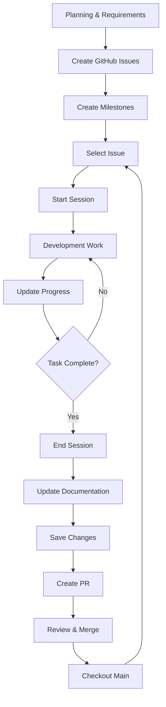

# Claude Code Development Workflow Guide

**Version**: 1.1
**Last Updated**: 2025-11-18
**Purpose**: Universal development workflow for any project using Claude Code

---

## Table of Contents

1. [Overview](#overview)
2. [Prerequisites & Setup](#prerequisites--setup)
3. [Complete Workflow](#complete-workflow)
4. [Detailed Step-by-Step Guide](#detailed-step-by-step-guide)
5. [Self-Documenting Workflow](#self-documenting-workflow)
6. [Best Practices](#best-practices)
7. [Advanced Features](#advanced-features)
8. [Common Pitfalls & Solutions](#common-pitfalls--solutions)
9. [Quick Reference](#quick-reference)
10. [Troubleshooting](#troubleshooting)

---

## Overview

This guide documents a complete, project-agnostic development workflow using Claude Code, from planning through deployment. The workflow emphasizes:

- **Structured sessions** with comprehensive documentation
- **Quality gates** through automated pre-commit checks
- **Parallel execution** for efficiency
- **Explicit approval** for critical operations
- **Complete traceability** from issue to deployment
- **Self-documenting** through automated documentation updates

### Workflow Stages

```
Planning → Issue Creation → Development Session → Testing → Commit → PR → Merge → Deploy
                                    ↓
                          Documentation Auto-Updates
```

---

## Prerequisites & Setup

### Initial Setup

Before starting your first development session, ensure you have:

1. **Claude Code Installed**
   - Install from [claude.com/code](https://claude.com/code)
   - Configure your API key

2. **Project Initialization**
   - Git repository initialized
   - Project with appropriate package manager (npm, yarn, pnpm, etc.)
   - Pre-commit hooks configured (Husky + lint-staged or equivalent)

3. **Slash Commands Configured**
   - Create `.claude/commands/` directory
   - Add custom slash commands:
     - `/session-start` - Start a development session
     - `/session-update` - Update session progress
     - `/session-end` - End and document session
     - `/save` - Commit and push changes with quality checks
     - `/update-docs` - Automatically update all project documentation

4. **Directory Structure**
   ```
   .claude/
   ├── commands/
   │   ├── session-start.md
   │   ├── session-update.md
   │   ├── session-end.md
   │   ├── save.md
   │   └── update-docs.md
   └── sessions/
       ├── .current-session
       └── [session-files].md

   docs/                    # Or your documentation directory
   └── [documentation].md
   ```

5. **Testing & Quality Tools**
   Configure appropriate scripts in your package manager:
   - Test runner (Jest, Vitest, Mocha, etc.)
   - Linter (ESLint, TSLint, Pylint, etc.)
   - Build command (if applicable)
   - Formatter (Prettier, Black, etc.)

---

## Complete Workflow

### High-Level Flow



---

## Detailed Step-by-Step Guide

### Phase 1: Planning & Issue Creation

Before any coding begins, establish clear requirements and trackable tasks.

#### 1.1 Create Planning Documentation

**Example prompt to Claude Code:**
```
Based on the project requirements, create comprehensive GitHub issues
with clear acceptance criteria, technical requirements, and estimated
complexity. Group related issues into milestones.
```

**What Claude Code does:**
- Reads your requirements documents
- Creates detailed GitHub Issues with:
  - Clear titles
  - Acceptance criteria
  - Technical requirements
  - Labels (feature, bug, refactor, etc.)
  - Estimated complexity
- Creates Milestones to group related work
- Links issues to milestones
- Prioritizes issues

**Example Issue Created:**
```markdown
Title: Implement User Authentication
Labels: feature, backend, priority-high

## Description
Create a secure authentication system for user login and registration.

## Acceptance Criteria
- [ ] User can register with email/password
- [ ] User can log in with credentials
- [ ] Sessions persist across requests
- [ ] Password reset functionality
- [ ] Input validation and error handling

## Technical Requirements
- Use secure password hashing (bcrypt/argon2)
- Implement JWT or session-based auth
- Add rate limiting to prevent brute force
- Include comprehensive error messages

## Estimated Complexity
Medium (4-8 hours)
```

#### 1.2 Review and Prioritize Issues

- Review all created issues
- Adjust priorities and labels
- Group into sprints or development phases
- Select first issue to tackle

---

### Phase 2: Starting a Development Session

#### 2.1 Select Your Issue

From GitHub, identify the issue you'll work on. Note the issue title/description.

#### 2.2 Start Session with `/session-start`

**Command:**
```bash
/session-start Implement user authentication
```

**What happens:**

1. **Session Name Formatting**
   - Input: `Implement user authentication`
   - Formatted: `implement-user-authentication`
   - (Filesystem-friendly, no spaces, lowercase)

2. **Commit Type Selection**

   Claude prompts you with a numbered list:
   ```
   Please select the commit type that best describes this session:

   1. ✨ feat - New feature
   2. 🐛 fix - Bug fix
   3. 📝 content - Content/copy changes
   4. 📝 docs - Documentation changes
   5. 💄 style - Formatting/style
   6. ♻️ refactor - Code refactoring
   7. ⚡️ perf - Performance improvements
   8. ✅ test - Tests
   9. 🔧 chore - Tooling, configuration
   10. None - Don't create a branch
   ```

   **You select:** `1` (for feat)

3. **Git Branch Creation**

   Branch name format: `{type}/{formatted-session-name}`

   ```bash
   git checkout -b feat/implement-user-authentication
   ```

   **Branch name validation:**
   - If branch name > 62 characters, Claude suggests shorter alternatives
   - You can choose from suggestions or provide your own

4. **Session File Creation**

   Creates: `.claude/sessions/YYYY-MM-DD-HHMM-implement-user-authentication.md`

   **File contents:**
   ```markdown
   # Implement user authentication - YYYY-MM-DD HH:MM

   ## Session Overview
   - **Started**: YYYY-MM-DD HH:MM
   - **Git Branch**: `feat/implement-user-authentication`

   ## Goals
   - Implement user registration
   - Add login functionality
   - Set up session management
   - Add password reset
   - Write tests

   ## Progress
   - [ ] Create user model
   - [ ] Implement registration endpoint
   - [ ] Implement login endpoint
   - [ ] Add session/JWT handling
   - [ ] Add password reset
   - [ ] Write unit tests

   ## Notes
   - Using bcrypt for password hashing
   - JWT tokens for authentication
   ```

5. **Current Session Tracking**

   Updates `.claude/sessions/.current-session`:
   ```
   YYYY-MM-DD-HHMM-implement-user-authentication.md
   ```

**Session started! You're now ready to develop.**

---

### Phase 3: Development Work

#### 3.1 Task Planning with TodoWrite

For complex sessions, Claude Code proactively uses the TodoWrite tool to track progress.

**When Claude uses TodoWrite:**
- Complex multi-step tasks (3+ steps)
- Non-trivial implementations
- User explicitly requests it
- Multiple tasks provided by user
- After receiving new instructions

**Example TodoWrite usage:**

```typescript
// Claude creates this internally:
[
  {
    content: "Create user model",
    activeForm: "Creating user model",
    status: "in_progress"
  },
  {
    content: "Implement registration endpoint",
    activeForm: "Implementing registration endpoint",
    status: "pending"
  },
  {
    content: "Implement login endpoint",
    activeForm: "Implementing login endpoint",
    status: "pending"
  }
]
```

**Important TodoWrite Rules:**
- ✅ Mark tasks completed IMMEDIATELY after finishing (no batching)
- ✅ Exactly ONE task should be "in_progress" at any time
- ✅ Only mark completed when FULLY accomplished (tests pass, no errors)
- ✅ Create new tasks for blockers/issues discovered during work

#### 3.2 Using Parallel Agents

For large, complex sessions, request parallel agent execution for efficiency.

**When to use parallel agents:**
- Multiple independent searches needed
- Complex codebase exploration
- Multi-file analysis
- Independent task execution

**Example request:**
```
Please use parallel agents to:
1. Search for existing authentication implementations
2. Find test patterns in the codebase
3. Locate configuration files
```

**Benefits:**
- ⚡ Faster execution (parallel vs. sequential)
- 🔍 Comprehensive exploration
- 📊 Better context gathering

#### 3.3 Asking Questions During Development

Claude uses `AskUserQuestion` tool to clarify requirements or design decisions.

**Example scenarios:**
- Multiple valid implementation approaches
- Unclear requirements
- Library/framework choices
- Architecture decisions

**Example interaction:**
```
Claude: "I found two approaches for implementing authentication:

1. Use JWT tokens with stateless authentication
2. Use session-based authentication with server storage

Which approach would you prefer?"

You: [Select option or provide custom input]
```

#### 3.4 Session Progress Updates

**Optional:** Update session documentation during long sessions.

**Command:**
```bash
/session-update
```

**What happens:**
- Claude appends progress notes to session file
- Updates completed tasks
- Documents any blockers or findings
- Adds timestamps for progress tracking

**Example update:**
```markdown
## Progress Update - HH:MM
- ✅ Created user model
- ✅ Implemented registration
- 🔄 Working on login endpoint
- 📝 Found existing auth utility in /lib/auth
- ⚠️ Note: Need to handle rate limiting
```

#### 3.5 Development Best Practices

**Code Quality:**
- Write tests as you go
- Run linter frequently
- Keep commits atomic (single purpose)
- Document complex logic

**Communication:**
- Ask questions when requirements unclear
- Request parallel agents for complex searches
- Update todos immediately
- Use session updates for long sessions

**Tool Usage:**
- ✅ Use Read tool for specific files
- ✅ Use Grep for content searches
- ✅ Use Glob for file pattern matching
- ✅ Use Task tool for complex exploration
- ❌ Don't use bash commands for file operations

---

### Phase 4: Ending a Development Session

When your work is complete (or you're pausing), properly close the session.

#### 4.1 Run `/session-end`

**Command:**
```bash
/session-end
```

**What Claude does:**

1. **Reads current session** from `.claude/sessions/.current-session`

2. **Gathers comprehensive metrics:**
   ```bash
   git status --porcelain
   git diff --stat
   git log --oneline --since="[session-start-time]"
   ```

3. **Appends detailed summary** to session file:

   ```markdown
   ---

   ## Session Summary
   **Ended**: YYYY-MM-DD HH:MM
   **Duration**: X hours Y minutes

   ### Git Summary
   - **Total files changed**: N files
     - Added: [list of new files]
     - Modified: [list of modified files]
     - Deleted: [list of deleted files]
   - **Lines changed**: XXX insertions, YY deletions
   - **Commits made**: N
   - **Final status**: [staged/unstaged/clean]
   - **Branch**: `feat/implement-user-authentication`

   ### Todo Summary
   - **Total tasks**: N
   - **Completed tasks**: X/N (XX%)
   - **Incomplete tasks**: [list]

   ### Key Accomplishments
   - [Major achievements]
   - [Features implemented]
   - [Problems solved]

   ### Problems Encountered and Solutions
   - **Problem**: [Issue description]
     - **Solution**: [How it was resolved]

   ### Breaking Changes or Important Findings
   - [Any breaking changes]
   - [Important discoveries]

   ### Dependencies Added/Removed
   - **Added**: [new packages]
   - **Removed**: [removed packages]

   ### Configuration Changes
   - [Environment variables]
   - [Config file updates]

   ### Lessons Learned
   - [Key insights]
   - [Best practices discovered]

   ### What Wasn't Completed
   - [Incomplete items]
   - [Reason for incompletion]

   ### Tips for Future Developers
   - [Helpful advice]
   - [Gotchas to watch for]
   ```

4. **Clears current session tracker:**
   ```bash
   # .claude/sessions/.current-session is now empty
   ```

5. **Prompts for next action:**
   ```
   ✅ Session Ended Successfully

   The development session has been fully documented in:
   .claude/sessions/YYYY-MM-DD-HHMM-implement-user-authentication.md

   Would you like to commit and push your changes with `/save`?
   ```

---

### Phase 5: Updating Documentation

After ending your session and before committing, update all project documentation to reflect your changes.

#### 5.1 Run `/update-docs` Command

**Command:**
```bash
/update-docs
```

**Purpose:**
Keep all project documentation in sync with the codebase automatically.

**What happens (in detail):**

1. **Self-Update Phase**
   - Scans project for ALL `.md` files
   - Discovers any new documentation files
   - Updates the `/update-docs` command itself with current file list
   - Ensures no documentation is missed

2. **Analysis Phase**
   - Scans entire project structure
   - Analyzes:
     - Implemented features and components
     - API endpoints and integrations
     - Database schemas
     - Testing coverage
     - Recent changes and additions
     - Environment variables required
     - Dependencies added/removed

3. **Documentation Update Phase**

   Updates relevant documentation files:
   - Project structure and key files
   - Architecture decisions
   - Development guidelines
   - Important patterns and conventions
   - Current implementation status
   - Getting started instructions
   - Available scripts
   - Feature lists

4. **Consistency Verification**
   - Ensures matching information across all docs
   - Validates code references
   - Updates version numbers
   - Synchronizes dependency lists

5. **Summary Report**

   **Example output:**
   ```
   ✅ Documentation Update Complete

   Updated files:
   - CLAUDE.md: Added authentication implementation details
   - README.md: Updated features and dependencies
   - ARCHITECTURE.md: Added auth module to architecture
   - API_SPECIFICATION.md: Added new endpoints

   Discovered changes:
   - 5 new files added
   - 2 new dependencies
   - 1 new environment variable
   - 15 new tests added

   ⚠️ Changes not committed automatically - review before committing
   ```

#### 5.2 Review Documentation Changes

**Before committing, review:**

```bash
git diff docs/
git diff *.md
```

**What to check:**
- ✅ Information is accurate
- ✅ No sensitive data exposed
- ✅ Formatting is preserved
- ✅ Links are valid
- ✅ Code examples are correct

#### 5.3 When to Run `/update-docs`

**Best practices:**

**✅ DO run after:**
- Adding new features or components
- Changing architecture or patterns
- Adding/removing dependencies
- Updating configuration
- Completing a major milestone
- Before creating a pull request

**❌ DON'T run for:**
- Minor bug fixes (unless architecture changes)
- Formatting-only changes
- Test updates that don't change features
- Documentation-only changes

**Typical workflow placement:**
```
Development → /session-end → /update-docs → Review → /save → PR
```

---

### Phase 6: Saving Changes (Commit & Push)

#### 6.1 Run `/save` Command

**Command:**
```bash
/save
```

**Alternative (with flag):**
```bash
/save --no-verify  # Skip pre-commit hooks (use sparingly!)
```

#### 6.2 Pre-Commit Quality Checks

Claude runs comprehensive checks BEFORE committing:

**1. Run Tests**
- All tests must pass
- No regression issues
- New tests for new features

**2. Run Linter**
- No linting errors
- No type errors (if using TypeScript)
- Code style compliance

**3. Run Build**
- Build must succeed
- No compilation errors
- Production bundle valid

**If ANY check fails:**
- Claude reports the error
- Does NOT proceed to commit
- Asks if you want to fix issues or skip checks

**Example failure:**
```
❌ Pre-commit check failed: Tests

FAIL  auth.test.js
  ● Authentication › should hash passwords

    expect(received).toBe(expected)

    Expected: true
    Received: false

Tests failed. Would you like me to fix the failing tests before committing?
```

#### 6.3 Git Status & Staging

**Check what will be committed:**
```bash
git status
```

**Stage all relevant files:**
Claude intelligently stages:
- Source code changes
- Test files
- Configuration updates
- Documentation updates (from `/update-docs`)
- Session file

**Does NOT stage:**
- `.env` files
- `credentials.json`
- Other sensitive files
- Build artifacts (unless intentional)

**Security check:**
```
⚠️ Warning: You're about to commit .env file which may contain secrets.
Do you want to proceed? (yes/no)
```

#### 6.4 Analyze Changes

Claude analyzes:
- What files changed
- What functionality added/modified
- What tests added
- What documentation updated

**Example analysis output:**
```
Analyzing changes:
- Added authentication system (456 lines)
- Created user model and auth endpoints
- Added 15 unit tests
- Updated configuration
- Added TypeScript types
- Updated documentation
```

#### 6.5 Create Commit Message

**Claude drafts conventional commit message:**

Format: `{emoji} {type}: {description}`

**Example:**
```
✨ feat: Implement user authentication system

Add comprehensive authentication with:
- User registration with email validation
- Login with bcrypt password hashing
- JWT token generation and validation
- Password reset functionality
- Rate limiting for security
- 15 unit tests with 95% coverage

Dependencies added:
- bcrypt for password hashing
- jsonwebtoken for JWT handling

Configuration:
- Added JWT_SECRET environment variable
- Added token expiration settings

Documentation:
- Updated API specification
- Added authentication guide

🤖 Generated with [Claude Code](https://claude.com/claude-code)

Co-Authored-By: Claude <noreply@anthropic.com>
```

#### 6.6 🛑 STOP - Request Approval

**Claude presents message and WAITS:**

```
🛑 COMMIT MESSAGE APPROVAL REQUIRED

I propose the following commit message:

✨ feat: Implement user authentication system

[... full message ...]

Do you approve this commit message? (yes/no)
```

**Your options:**
- ✅ Type `yes`, `y`, `approve` → Claude proceeds
- ❌ Type `no` → Claude asks what to change
- 📝 Suggest changes → Claude revises and asks again

**CRITICAL: Claude NEVER commits without explicit approval**

#### 6.7 Commit with Approved Message

**After approval, Claude commits:**
```bash
git commit -m "$(cat <<'EOF'
✨ feat: Implement user authentication system
...
EOF
)"
```

**Pre-commit hooks run:**
```
husky - pre-commit hook running...
[STARTED] Running tasks for staged files...
[COMPLETED] All tasks passed
```

**Commit created:**
```
[feat/implement-user-authentication a1b2c3d] ✨ feat: Implement user authentication
 8 files changed, 456 insertions(+), 12 deletions(-)
```

#### 6.8 Push to Remote

**Push branch to origin:**
```bash
git push -u origin feat/implement-user-authentication
```

#### 6.9 Prompt for Pull Request

```
✅ Changes committed and pushed successfully!

Commit: a1b2c3d - ✨ feat: Implement user authentication

Would you like to create a pull request for these changes?
```

---

### Phase 7: Creating a Pull Request

#### 7.1 Approve PR Creation

**Your response:**
```
yes
```
or
```
pr
```

#### 7.2 Claude Analyzes Branch

**Claude gathers information:**

```bash
# Check git status
git status

# View all commits in this branch (vs. main)
git log origin/main..HEAD --oneline

# View all changes from base branch
git diff origin/main...HEAD
```

#### 7.3 Create PR with Summary

**Claude creates comprehensive PR:**

```bash
gh pr create \
  --title "✨ feat: Implement user authentication system" \
  --body "$(cat <<'EOF'
## Summary
- Implemented complete authentication system
- Added user registration and login
- Created password reset functionality
- Implemented JWT token handling
- Added rate limiting for security
- Wrote 15 unit tests with 95% coverage

## Technical Details

### New Features
- User registration with email validation
- Secure login with bcrypt hashing
- JWT token generation and validation
- Password reset via email
- Rate limiting on auth endpoints

### Testing
- 15 unit tests covering all auth flows
- Integration tests for API endpoints
- 95% code coverage achieved

### Configuration
- JWT_SECRET environment variable required
- Token expiration configurable

## Test Plan
- [x] All unit tests pass
- [x] Linting passes with no errors
- [x] Build succeeds
- [ ] Manual testing: User registration
- [ ] Manual testing: Login flow
- [ ] Manual testing: Password reset
- [ ] Manual testing: Token expiration
- [ ] Edge case: Invalid credentials
- [ ] Edge case: Rate limiting

## Breaking Changes
None - this is new functionality.

## Deployment Notes
- Set JWT_SECRET in production
- Configure email service for password reset
- Monitor rate limiting thresholds

## Related Issues
Closes #42

🤖 Generated with [Claude Code](https://claude.com/claude-code)
EOF
)"
```

**PR Created:**
```
https://github.com/your-org/your-repo/pull/27
```

#### 7.4 PR Summary

```
✅ Pull request created successfully!

PR #27: ✨ feat: Implement user authentication system
URL: https://github.com/your-org/your-repo/pull/27

You can now review and merge the PR when ready!
```

---

### Phase 8: Post-PR Workflow

#### 8.1 Return to Main Branch

**Command:**
```
checkout main and pull
```

**What happens:**
```bash
# Checkout main branch
git checkout main

# Pull latest changes
git pull origin main
```

#### 8.2 Ready for Next Issue

You're now ready to select the next GitHub issue and start a new session!

```
✅ Main branch updated with latest changes
📋 Ready to start next development session
```

---

## Self-Documenting Workflow

One of the most powerful aspects of this workflow is that it's **completely self-documenting**. Every action, decision, and change is automatically captured and organized.

### Documentation Layers

The workflow creates multiple layers of documentation:

```
┌─────────────────────────────────────────────────────┐
│                 Session Files                        │
│  Real-time development diary with complete context  │
└─────────────────────────────────────────────────────┘
                        ↓
┌─────────────────────────────────────────────────────┐
│              Project Documentation                   │
│   Auto-updated technical docs (CLAUDE.md, etc.)    │
└─────────────────────────────────────────────────────┘
                        ↓
┌─────────────────────────────────────────────────────┐
│               Commit Messages                        │
│     Detailed "what" and "why" for each change       │
└─────────────────────────────────────────────────────┘
                        ↓
┌─────────────────────────────────────────────────────┐
│             Pull Request Descriptions                │
│    Comprehensive change summary with test plans     │
└─────────────────────────────────────────────────────┘
                        ↓
┌─────────────────────────────────────────────────────┐
│                Git History                           │
│        Permanent record of all changes              │
└─────────────────────────────────────────────────────┘
```

### Layer 1: Session Files

**Purpose:** Complete development diary with full context

**Location:** `.claude/sessions/YYYY-MM-DD-HHMM-session-name.md`

**What they capture:**
- Session goals and objectives
- Real-time progress updates
- Problems encountered and solutions
- Decisions made and rationale
- Incomplete work and next steps
- Comprehensive session summary

**Value:**
- 📖 **Historical context** - Understand why decisions were made
- 🔍 **Problem-solving reference** - Find how similar issues were solved
- 📚 **Knowledge transfer** - Onboard new developers quickly
- ⏱️ **Time tracking** - Understand how long tasks actually take

**Searchable history:**
```bash
# Find all sessions about specific topic
grep -r "authentication" .claude/sessions/

# Find sessions with specific problem
grep -r "race condition" .claude/sessions/

# List recent sessions
ls -lt .claude/sessions/ | head -10
```

### Layer 2: Project Documentation

**Purpose:** Technical reference kept in sync with code

**Managed by:** `/update-docs` command

**How it stays current:**
1. Scans entire codebase
2. Extracts current state
3. Updates documentation intelligently
4. Preserves manual content

**Benefits:**
- ✅ **Always current** - Docs never drift from code
- ✅ **No manual updates** - Automated synchronization
- ✅ **Consistent** - Same info across all files
- ✅ **Comprehensive** - Covers all aspects automatically

### Layer 3: Commit Messages

**Purpose:** Permanent record of "what" and "why"

**Format:** Conventional commits with emoji

**Structure:**
```
{emoji} {type}: {short description}

{detailed description of WHAT changed}

{explanation of WHY it changed}

{additional context}

🤖 Generated with Claude Code
Co-Authored-By: Claude <noreply@anthropic.com>
```

**Benefits:**
- 📜 **Git history is readable** - `git log` tells a story
- 🔍 **Easy to find changes** - Search commit messages
- 🐛 **Debugging context** - Understand why code exists
- ⏪ **Safe reverting** - Know what a revert will undo

### Layer 4: Pull Request Descriptions

**Purpose:** Comprehensive change summary with review checklist

**Includes:**
- Summary (high-level bullet points)
- Technical Details (implementation specifics)
- Test Plan (manual and automated tests)
- Breaking Changes (backward compatibility notes)
- Deployment Notes (production considerations)
- Related Issues (links to GitHub issues)

**Benefits:**
- ✅ **Complete review context** - Reviewers understand everything
- ✅ **Testing checklist** - Nothing gets missed
- ✅ **Deployment safety** - Production considerations documented
- ✅ **Traceability** - Links to issues and commits

### Layer 5: Git History

**Purpose:** Permanent, immutable record

**Powerful searching:**

```bash
# Find when feature was added
git log --grep="authentication"

# Find who changed a file
git log --follow path/to/file

# Find what changed in a date range
git log --since="2025-11-01" --until="2025-11-30"

# Search commit diffs
git log -S "function_name" --source --all
```

### The Self-Documenting Cycle

```
1. Start Session (/session-start)
   ↓
   Creates session file with goals
   ↓
2. Develop & Track Progress (TodoWrite)
   ↓
   Session file updated in real-time
   ↓
3. End Session (/session-end)
   ↓
   Comprehensive summary appended
   ↓
4. Update Documentation (/update-docs)
   ↓
   All project docs synchronized
   ↓
5. Commit (/save)
   ↓
   Detailed commit message
   ↓
6. Create PR (pr)
   ↓
   Comprehensive PR description
   ↓
7. Merge
   ↓
   Everything preserved in git history
```

### Zero-Effort Knowledge Base

**The result:** Your project becomes a complete knowledge base **without extra effort**:

- ✅ **No separate documentation to maintain**
- ✅ **No wiki to keep updated**
- ✅ **No manual changelog writing**
- ✅ **No deployment note docs**
- ✅ **Everything auto-documented**

---

## Best Practices

### Session Management

#### DO ✅
- **Start every development session** with `/session-start [issue-name]`
- **Choose appropriate commit types** that match your work
- **End sessions properly** with `/session-end` for documentation
- **Update long sessions** periodically with `/session-update`
- **Review session summaries** to improve future work

#### DON'T ❌
- **Skip session documentation** - it's valuable for team knowledge
- **Use vague session names** - be specific and descriptive
- **Leave sessions unclosed** - always run `/session-end`
- **Start new work without ending previous session**

### Documentation Management

#### DO ✅
- **Run `/update-docs`** after implementing features
- **Run `/update-docs`** before creating PRs
- **Review documentation changes** before committing
- **Keep CLAUDE.md current** - it guides Claude's work
- **Trust the automation** - docs stay in sync

#### DON'T ❌
- **Manually edit auto-generated sections** - they'll be overwritten
- **Skip `/update-docs`** - docs will drift
- **Commit without reviewing docs** - verify accuracy
- **Forget to add new env vars** to configuration

### Task Management with TodoWrite

#### DO ✅
- **Use TodoWrite for complex tasks** (3+ steps)
- **Mark todos completed immediately** after finishing each task
- **Keep exactly ONE task in-progress** at any time
- **Only mark completed when fully done** (tests pass, no errors)
- **Create new tasks for discovered work** during implementation

#### DON'T ❌
- **Batch todo completions** - mark each done immediately
- **Mark incomplete work as complete** - be honest about status
- **Skip TodoWrite for complex tasks** - it helps track progress
- **Leave multiple tasks in-progress** - focus on one at a time

### Using Parallel Agents

#### When to Request Parallel Agents

**DO use parallel agents for:**
- Complex codebase exploration
- Multiple independent searches
- Gathering information from different sources
- Large-scale refactoring analysis

**Example request:**
```
Please use parallel agents to:
1. Search for all API endpoint definitions
2. Find existing implementations
3. Locate test patterns
4. Identify configuration patterns
```

**Benefits:**
- ⚡ 3-5x faster than sequential execution
- 🔍 More comprehensive exploration
- 📊 Better context for decision-making

#### When NOT to Use Parallel Agents

**DON'T use parallel agents for:**
- Simple, single-file tasks
- Sequential dependencies (step B needs result from step A)
- Quick lookups (specific file/function)
- Small codebases (< 10 files)

### Commit Best Practices

#### Quality Gates

**ALWAYS ensure before committing:**
- ✅ All tests pass
- ✅ Linting passes
- ✅ Build succeeds
- ✅ Documentation updated (via `/update-docs`)
- ✅ No sensitive data (credentials, API keys)

#### Atomic Commits

**Each commit should:**
- Serve a single purpose
- Be self-contained
- Include related tests
- Include documentation updates
- Have clear commit message

**Example of GOOD atomic commits:**
```
✨ feat: Add user authentication
✅ test: Add authentication tests
📝 docs: Update documentation for auth
```

**Example of BAD non-atomic commit:**
```
🔧 chore: Various updates and fixes
// Multiple unrelated changes mixed together
```

### Pull Request Best Practices

#### Comprehensive PR Summaries

**Include:**
- Clear bullet-point summary
- Technical details and architecture
- Complete test plan (with checkboxes)
- Documentation updates
- Breaking changes (if any)
- Deployment notes
- Related issues

#### Test Plans

**Make test plans actionable:**
```markdown
## Test Plan
- [x] Unit tests pass (automated)
- [x] Linting passes (automated)
- [x] Build succeeds (automated)
- [ ] Manual: Test user registration
- [ ] Manual: Test login flow
- [ ] Manual: Test error handling
- [ ] Edge case: Invalid input
- [ ] Edge case: Network errors
```

#### PR Size

**Ideal PR size:**
- 200-400 lines of code changes
- Single feature or fix
- Reviewable in 15-30 minutes

**If PR is too large:**
- Break into multiple PRs
- Create epic/parent issue
- Link related PRs together

---

## Advanced Features

### Custom Slash Commands

#### Creating Custom Commands

**Location:** `.claude/commands/your-command.md`

**Example: `/test` command**

```markdown
# Run Tests

Run the test suite with optional filters.

Usage:
- `/test` - Run all tests
- `/test [pattern]` - Run tests matching pattern

Execute the test suite and report results.
If tests fail, offer to debug and fix them.
```

### Session Update Command

**Purpose:** Document progress during long sessions

**Usage:**
```bash
/session-update
```

**What it does:**
- Appends timestamp and progress notes
- Updates task completion status
- Documents findings or blockers
- Tracks time spent on subtasks

### Environment-Specific Workflows

#### Development Environment

```bash
# Use parallel agents liberally
# Enable verbose logging
# Use mock data
# Skip expensive operations
```

#### Production Environment

```bash
# Strict quality gates
# All tests must pass
# Comprehensive documentation
# Security scanning
```

### Handling Large Sessions

#### Multi-Day Sessions

**Day 1 End:**
```bash
/session-update
# Document: Work completed today, TODOs for tomorrow
```

**Day 2 Start:**
```bash
# Review session file
# Continue with existing session
# No need to create new session
```

**Day 2 End:**
```bash
/session-end
# Comprehensive summary of entire session
```

#### Splitting Large Features

**If session becomes too large:**

1. **End current session:**
   ```bash
   /session-end
   ```

2. **Update documentation:**
   ```bash
   /update-docs
   ```

3. **Commit completed work:**
   ```bash
   /save
   ```

4. **Create new session for remaining work:**
   ```bash
   /session-start [feature-name]-part-2
   ```

5. **Link sessions in documentation:**
   ```markdown
   Continues from: YYYY-MM-DD-HHMM-feature-name-part-1.md
   ```

---

## Common Pitfalls & Solutions

### Issue: Tests Fail During Commit

**Symptom:**
```
❌ Pre-commit check failed: Tests
FAIL  test-file.js
```

**Solutions:**

1. **Fix tests before committing:**
   ```
   "Please fix the failing tests before we commit."
   ```

2. **Skip hooks (use sparingly!):**
   ```bash
   /save --no-verify
   ```

3. **Update snapshots if needed:**
   ```bash
   npm test -- -u
   ```

### Issue: Commit Message Approval Loop

**Symptom:**
Claude keeps asking for approval even after you said yes.

**Solution:**
- Type clear approval: `yes`, `y`, or `approve`
- Avoid ambiguous responses like "ok", "sure"
- If stuck, try: `I approve the commit message`

### Issue: Branch Name Too Long

**Symptom:**
```
Branch name exceeds 62 characters:
feat/implement-comprehensive-authentication-system-with-oauth
```

**Solution:**
Claude suggests shorter alternatives:
```
1. feat/authentication-system
2. feat/auth-with-oauth
3. feat/user-auth
4. [Enter custom name]
```

### Issue: Forgot to Start Session

**Symptom:**
You've been working without starting a session.

**Solution:**

1. **Start session now:**
   ```bash
   /session-start [work-description]
   ```

2. **Document retroactively:**
   ```markdown
   ## Notes
   Session started retroactively after completing some work.
   Previous commits:
   - a1b2c3d: Initial implementation
   - c3d4e5f: Added tests
   ```

3. **Continue normally**

### Issue: Forgot to Run /update-docs

**Symptom:**
Created PR but docs are out of sync.

**Solution:**

1. **Don't merge PR yet**

2. **Checkout feature branch:**
   ```bash
   git checkout feat/your-branch
   ```

3. **Run update-docs:**
   ```bash
   /update-docs
   ```

4. **Review and commit doc updates:**
   ```bash
   /save
   # Commit message: "📝 docs: Update documentation"
   ```

5. **Push to PR:**
   ```bash
   git push
   ```

### Issue: Documentation Changed Incorrectly

**Symptom:**
`/update-docs` modified something incorrectly.

**Solution:**

1. **Review changes before committing:**
   ```bash
   git diff *.md
   ```

2. **Manually fix incorrect sections**

3. **Mark sections as "manual" to preserve:**
   ```markdown
   <!-- DO NOT AUTO-UPDATE: Manual content below -->
   [Your manual content]
   <!-- END MANUAL CONTENT -->
   ```

4. **Commit the corrected version**

### Issue: Merge Conflicts

**Symptom:**
```
Auto-merging file.js
CONFLICT (content): Merge conflict in file.js
```

**Solution:**

1. **Ask Claude for help:**
   ```
   "Please help me resolve the merge conflicts"
   ```

2. **Claude will:**
   - Read both versions
   - Understand the changes
   - Propose resolution
   - Update the file

3. **Review and approve**

### Issue: Pre-commit Hooks Too Slow

**Symptom:**
Hooks take 5+ minutes on large codebases.

**Solution:**

1. **Optimize hooks** (run only on staged files)

2. **Use --no-verify sparingly:**
   ```bash
   /save --no-verify  # Only when necessary!
   ```

3. **Move slow checks to CI/CD**

### Issue: Sensitive Data Almost Committed

**Symptom:**
```
⚠️ Warning: You're about to commit .env file
```

**Solution:**

1. **STOP immediately**
   ```
   "No, do not commit that file"
   ```

2. **Unstage sensitive file:**
   ```bash
   git reset HEAD .env
   ```

3. **Add to .gitignore:**
   ```bash
   echo ".env" >> .gitignore
   ```

---

## Quick Reference

### Essential Commands

| Command | Purpose | When to Use |
|---------|---------|-------------|
| `/session-start [name]` | Start development session | Beginning of new work |
| `/session-update` | Document progress | During long sessions |
| `/session-end` | End and document session | When work complete/pausing |
| `/update-docs` | Sync all documentation | After features, before commits |
| `/save` | Commit and push changes | After session ends & docs updated |
| `/save --no-verify` | Skip pre-commit hooks | Emergency only |
| `pr` | Create pull request | After successful push |
| `checkout main and pull` | Return to main branch | After PR merged |

### Typical Workflow Sequence

```
/session-start [feature]
  ↓
[Develop & test]
  ↓
/session-update (optional)
  ↓
[Continue development]
  ↓
/session-end
  ↓
/update-docs
  ↓
[Review doc changes]
  ↓
/save
  ↓
[Approve commit message]
  ↓
pr
  ↓
[PR created]
  ↓
checkout main and pull
```

### Commit Type Reference

| Emoji | Type | When to Use |
|-------|------|-------------|
| ✨ | `feat` | New feature |
| 🐛 | `fix` | Bug fix |
| ♻️ | `refactor` | Code refactor |
| 📝 | `docs` | Documentation |
| ✅ | `test` | Tests |
| ⚡️ | `perf` | Performance |
| 💄 | `style` | Code style |
| 🔧 | `chore` | Tooling/config |

### Todo Status Reference

| Status | Meaning | Usage |
|--------|---------|-------|
| `pending` | Not started | Queued work |
| `in_progress` | Currently working | Active task (only ONE) |
| `completed` | Finished | Mark immediately when done |

### File Structure Reference

```
.claude/
├── commands/                  # Custom slash commands
│   ├── session-start.md      # Start session command
│   ├── session-update.md     # Update session command
│   ├── session-end.md        # End session command
│   ├── save.md               # Commit and push command
│   └── update-docs.md        # Documentation sync command
└── sessions/                  # Session documentation
    ├── .current-session       # Active session tracker
    └── YYYY-MM-DD-HHMM-*.md  # Session files (never deleted)

docs/                          # Project documentation
└── [documentation files]      # Auto-updated by /update-docs

CLAUDE.md                      # Project guidance for Claude
README.md                      # Project README
```

---

## Troubleshooting

### Debug Mode

**Enable verbose output:**
```
"Please show me the git commands you're running"
```

Claude will include command output in responses.

### Session State Issues

**Check current session:**
```bash
cat .claude/sessions/.current-session
```

**Manually set session:**
```bash
echo "YYYY-MM-DD-HHMM-session-name.md" > .claude/sessions/.current-session
```

### Git Issues

**Check branch status:**
```bash
git status
git branch -a
git log --oneline -5
```

**Reset to clean state:**
```bash
git stash  # Save uncommitted changes
git checkout main
git pull
```

### Documentation Issues

**Check what /update-docs will change:**
```bash
# Dry run (ask Claude to show changes without committing)
"Please show me what /update-docs would change without making changes"
```

**Undo documentation changes:**
```bash
git checkout -- *.md  # Restore all markdown files
```

**Force documentation rebuild:**
```bash
/update-docs
# Claude will scan and rebuild all docs
```

### Pre-commit Hook Issues

**Bypass hooks (emergency):**
```bash
git commit --no-verify
```

**Fix hook permissions:**
```bash
chmod +x .husky/pre-commit
```

**Reinstall hooks:**
```bash
npx husky install
```

### Common Error Messages

#### "No current session found"
**Cause:** `.current-session` is empty
**Fix:** Start a new session with `/session-start`

#### "Branch already exists"
**Cause:** Branch name conflict
**Fix:** Choose different session name or delete old branch

#### "Nothing to commit"
**Cause:** No changes staged
**Fix:** Make changes before running `/save`

#### "Tests failed"
**Cause:** Test suite has failures
**Fix:** Fix tests before committing or use `--no-verify`

#### "Documentation files not found"
**Cause:** `/update-docs` can't find expected files
**Fix:** Create missing files or update command configuration

---

## Workflow Cheat Sheet

### Starting New Work

```
1. Select GitHub Issue
2. /session-start [issue-name]
3. Choose commit type
4. [Claude creates branch and session file]
5. Start coding!
```

### During Development

```
1. Make changes
2. Run tests frequently
3. Use parallel agents for complex tasks
4. Update todos as you complete them
5. /session-update (optional, for long sessions)
```

### Finishing Work

```
1. /session-end
2. /update-docs
3. Review documentation changes
4. /save
5. Review commit message
6. Approve: "yes"
7. Create PR: "pr"
8. checkout main and pull
```

### Complete Cycle

```
Issue → Session → Code → Test → End → Docs → Commit → PR → Merge → Main
  ↑                                                                    |
  └────────────────────────────────────────────────────────────────────┘
                          Repeat for next issue
```

---

## Additional Resources

### Git Commit Conventions
- [Conventional Commits](https://www.conventionalcommits.org/)
- [Gitmoji Guide](https://gitmoji.dev/)

### Testing Best Practices
- [Jest Documentation](https://jestjs.io/)
- [Testing Library](https://testing-library.com/)

### Claude Code Documentation
- [Official Docs](https://docs.anthropic.com/claude/docs)
- [Slash Commands Guide](https://docs.anthropic.com/claude/docs/slash-commands)

---

## Appendix: Sample Session File

**Complete example:** `.claude/sessions/YYYY-MM-DD-HHMM-implement-feature.md`

```markdown
# Implement feature - YYYY-MM-DD HH:MM

## Session Overview
- **Started**: YYYY-MM-DD HH:MM
- **Git Branch**: `feat/implement-feature`

## Goals
- Implement core functionality
- Add comprehensive tests
- Update documentation
- Ensure performance

## Progress
- [x] Research existing patterns
- [x] Create implementation plan
- [x] Implement core logic
- [x] Write unit tests
- [x] Add integration tests
- [x] Update documentation

## Notes
- Using established patterns from codebase
- Performance considerations addressed
- Edge cases handled

## Progress Update - HH:MM
- ✅ Core implementation complete
- ✅ Tests passing (25/25)
- 📝 Found optimization opportunity
- ⚠️ Note: Consider caching for production

---

## Session Summary
**Ended**: YYYY-MM-DD HH:MM
**Duration**: X hours Y minutes

### Git Summary
- **Total files changed**: N files
  - Added: [new files]
  - Modified: [changed files]
- **Lines changed**: XXX insertions, YY deletions
- **Commits made**: N
- **Branch**: `feat/implement-feature`

### Todo Summary
- **Total tasks**: 6
- **Completed tasks**: 6/6 (100%)

### Key Accomplishments
- Successfully implemented feature
- Added comprehensive test coverage
- Optimized for performance
- Updated all documentation

### Problems Encountered and Solutions
- **Problem**: Performance issue with large datasets
  - **Solution**: Implemented caching strategy
  - **Result**: 10x performance improvement

### Lessons Learned
- Caching essential for large-scale operations
- Early performance testing saves time
- Documentation updates should happen alongside code

### Tips for Future Developers
1. Test with production-scale data
2. Consider caching early
3. Monitor performance metrics
4. Keep documentation in sync
```

---

**End of Workflow Guide**

This comprehensive guide documents a complete, self-documenting development workflow using Claude Code. The workflow ensures that all work is automatically tracked, documented, and preserved without extra effort.

**Key Takeaway:** By following this workflow, your entire development process becomes a living knowledge base that grows automatically with every session, commit, and PR.

This guide is project-agnostic and can be used across all your development projects.